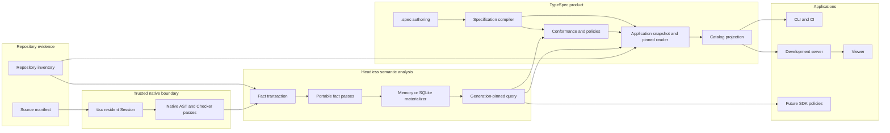

# ADR: TypeSpec V2 semantic foundation and ownership DAG

Status: ratified

Implementation state: planned

Impact: high

Cutover: clean, coordinated, no compatibility aliases or dual readers

Target: the unreleased `@astrale-os/spec` `1.0.0` contract

Date: 2026-08-13

Related: [Astrale specification tooling](../../README.md),
[`ttsc` graph](https://ttsc.dev/docs/graph/), and
[`ttsc` AST and Checker](https://ttsc.dev/docs/development/concepts/tsgo/), and the
[`@optave/codegraph` source](https://github.com/optave/ops-codegraph-tool)

## Decision

TypeSpec V2 separates specification authority, compiler observation, qualification, persistence,
and presentation into an acyclic set of headless modules. TypeSpec remains the Astrale product that
authors and qualifies `.spec`, but it becomes a consumer of a reusable semantic-analysis
foundation rather than the permanent owner of TypeScript indexing.

The selected TypeScript substrate is `ttsc` and TypeScript-Go. Native Go passes own work that must
share the live TypeScript AST and Checker. Portable TypeScript passes and policies consume
versioned facts; they never receive compiler pointers. All facts are committed as complete,
generation-scoped transactions through interchangeable memory and SQLite materializers. CLI,
server, viewer, TypeSpec conformance, and future SDK linting query immutable snapshots.

The current `.spec` language remains the product's authoring model. V2 does not presume every
current construct is permanent: each construct is audited against its semantic owner, and any
justified change is migrated across the complete corpus in one clean pre-1.0 cut. Sound constructs
are retained. Cosmetic symmetry is not a reason to change authoring.

The internal `manifest-v1` and `SPEC.yml` model is deleted completely during the cut. V2 has one
canonical specification model and therefore no profile discriminant. Historical files remain
ordinary repository artifacts when retained by history; TypeSpec does not give them an executable
or compatibility reader.

TypeSpec V2 initially remains one published package, `@astrale-os/spec`. Its public subpaths and
internal import rules form a hard, extraction-ready DAG. Package splitting is allowed later only
when it preserves these contracts; it is not required to create them.

## Name and version boundary

"TypeSpec V2" names the architecture ratified by this ADR. It is unrelated to the current
`profile: 'module-v2'` implementation tag. That tag distinguishes the current convention profile
from `manifest-v1` and disappears when the legacy profile is deleted.

This ADR ratifies the target. It does not claim that the current implementation conforms. Until the
coordinated cutover, current TypeSpec remains authoritative and V2 may run only as shadow evidence.

## Context

The current `@astrale-os/spec` package contains several useful products:

- `.spec` authoring primitives and a closed convention language;
- specification discovery, compilation, validation, and catalog composition;
- public TypeScript API observation and exact conformance comparison;
- implementation dependency, cycle, reachability, and line analysis;
- evidence planning and qualification commands;
- persistent development caches, a live server, and filesystem watching; and
- catalog transport and a React viewer.

Its file import graph is acyclic, and its current qualification is green. V2 is not a response to
an unusable codebase. The architectural problem is that several different authorities and
lifecycles are currently represented by mutable catalog objects and incidental compiler reuse:

- declaration/API compilation and implementation-project observation are both described as
  "compiler" work despite owning different semantics;
- code analysis keeps a weak reference to a Node TypeScript `Program` so verification can happen to
  reuse it, rather than depending on an explicit semantic snapshot;
- catalog building mutates modules with code and verification observations;
- each watch cycle can rebuild compiler-heavy catalog projections even when only a bounded fact
  shard changed;
- the current binary cache persists heterogeneous evidence but is not a queryable materialized
  semantic index; and
- `manifest-v1` remains threaded through catalog, viewer, and verification unions even though new
  `SPEC.yml` authoring is already rejected.

The current implementation can inspect TypeScript declarations and imports accurately. It does not
own a general occurrence graph, function-body IR, control-flow graph, definition-use relation,
bounded evaluator, durable query store, or pass-extension protocol. Adding each of those directly
to TypeSpec would overfit a reusable compiler problem to one consumer.

`ttsc` supplies the missing compiler substrate: a resident TypeScript-Go `Program`, exact Checker
queries, incremental program updates, native plugin linkage, checker-resolved graph construction,
and content-addressed transactional graph shards. Its current `@ttsc/graph` product is deliberately
a fixed declaration/relationship graph. It deduplicates relationships and omits bodies from the
wire format, so it cannot itself be our occurrence, control-flow, value, or arbitrary-fact model.
The underlying AST and Checker can build those facts.

## Evidence status

| Evidence | Status | Use in this decision |
| --- | --- | --- |
| Current `.spec` corpus and `spec/README.md` | Governing current product | Establishes the authoring language and consumer expectations to audit and migrate |
| Current `spec/` implementation and package exports | Implementation evidence | Establishes existing responsibilities, seams, compiler lifecycles, and legacy coupling |
| Current TypeSpec tests and repository check | Test evidence | Establishes the parity baseline; passing does not ratify current ownership |
| Repository imports of `@astrale-os/spec/authoring` | Downstream consumer evidence | Establishes the authoring migration blast radius |
| `ttsc` 0.26.2 documentation and source | External candidate evidence | Establishes available Session, AST/Checker, lint, graph, and shard mechanics |
| Local `ttsc` graph probes of TypeSpec and the SDK | Focused feasibility evidence | Proves the current projects can be resolved; it is not broad compatibility or performance proof |
| Headless repository-analysis candidate | Candidate implementation evidence | Establishes reusable classification and reporting shapes; it is not yet governing source |
| Codegraph 3.16.0 source and integration spike | Named alternative evidence | Establishes which SQLite, query, and churn patterns are reusable and why its package, parser, graph schema, and lifecycle are not the V2 substrate |
| This ADR | Ratified target decision | Governs the V2 ownership DAG, migration, and qualification gates |

## Goals

V2 must provide:

1. exact TypeScript symbol, alias, barrel, overload, type, and call resolution;
2. a resident, incrementally refreshed compiler universe;
3. versioned declaration, occurrence, body, control-flow, definition-use, and summary facts;
4. bounded value reasoning with explicit epistemic results;
5. arbitrary namespaced analysis passes without coupling their facts to TypeSpec;
6. atomic memory and SQLite materialization with coherent snapshot queries;
7. reusable TypeScript policies over portable facts;
8. one normative `.spec` model and a separate qualification result;
9. deterministic CLI, CI, server, and viewer projections from the same generations; and
10. an extraction-ready package and dependency boundary that can serve other repositories.

## Non-goals

V2 does not:

- execute repository TypeScript or `.spec` descriptor modules;
- expose Go AST, Checker, compiler handles, SQLite connections, or native wire objects to ordinary
  TypeScript consumers;
- promise unrestricted JavaScript evaluation or whole-program theorem proving;
- make Codegraph, another graph package, or an external graph service part of TypeSpec correctness;
- inherit a second TypeScript parser, fixed graph ontology, mutable-current lifecycle, or
  checkout-local database identity merely to reuse storage machinery;
- put SDK-specific builder semantics inside the generic analyzer or TypeSpec;
- treat counts, graph metrics, or unknown analysis as quality scores;
- guarantee stable identities for edited expression occurrences;
- preserve `manifest-v1`, `SPEC.yml`, deprecated package exports, or dual catalog transports; or
- require immediate publication as several packages.

## Vocabulary

| Term | Meaning and owner |
| --- | --- |
| `SpecificationSnapshot` | Immutable compiled meaning of one admitted `.spec` source manifest; owned by specification compilation |
| `ProjectUniverse` | Compiler inputs that decide which TypeScript files and semantics exist: config chain, root set, options, producer, plugins, and platform assumptions |
| `AnalysisGeneration` | One immutable fact generation produced from one `ProjectUniverse` and one source manifest |
| `SourceRevision` | One portable logical source identity paired with the exact checker-observed bytes and decoding |
| `Fact` | A versioned, namespaced observation or derivation with evidence and completeness |
| `AnalysisSnapshot` | A query view pinned to one committed `AnalysisGeneration` |
| `AnalysisSnapshotSet` | Immutable repository view naming the exact inventory revision and generation for every included universe |
| `QualificationSnapshot` | Immutable comparison and policy results tied to exact specification and analysis identities |
| `TypeSpecApplicationSnapshot` | Immutable composition of one repository inventory, normative snapshots, pinned analysis generations, repository statistics, and qualification results; it is a workflow boundary, not a fifth semantic authority |
| `Projection` | Presentation or transport DTO derived from snapshots; never another authority |
| `Native pass` | Trusted Go analysis that reads the live AST/Checker and emits portable facts |
| `Portable pass` | TypeScript analysis that reads committed or staged upstream facts and emits derived facts |
| `Policy` | TypeScript consumer of facts that emits qualification diagnostics, not compiler facts |
| `Materializer` | Store implementing atomic fact commits and generation-pinned queries |

"Fact", "diagnostic", and "policy" are not aliases. Compiler diagnostics are observed facts about a
generation. Analysis-pass failure is provenance about missing facts. Policy and conformance
diagnostics are judgments in a `QualificationSnapshot`.

## Four independent authorities

### Normative specification

`SpecificationSnapshot` is the only authority for what a module promises, requires, and owns. It is
compiled from admitted `.spec` sources without executing them. It contains normalized expected
contracts and references to authored sources. It does not contain implementation observations,
resolved test status, layout observation, live compiler objects, or viewer state.

### Observed analysis

`AnalysisSnapshot` is the only authority for what one compiler generation observed.
`AnalysisSnapshotSet` is the only authority for a repository view composed from several project
universes. It pins every constituent generation and the repository inventory revision, so a query
cannot combine whichever generation happens to be current in each project. Both contain facts and
compiler diagnostics, never product requirements. A complete empty fact set and an uncollected fact
set are distinct through pass capability and completeness metadata.

### Derived qualification

`QualificationSnapshot` is the only authority for how a particular specification snapshot compares
with a particular analysis snapshot and which policies passed. It references both immutable
identities. It may not mutate either input or smuggle observations back into the specification.

### Presentation projection

Catalog index, catalog detail, CLI summaries, HTTP payloads, and viewer models are disposable
projections. They reference content revisions and snapshot identities. They contain neither source
authority nor mutable analysis state.

## Ownership DAG



The arrows show allowed information flow. Import direction runs from each consumer to its upstream
contract and is constrained separately by the laws below; presentation or policy code cannot feed
authority back into an upstream snapshot.

## Package and module boundaries

V2 keeps one package while exposing deliberate public subpaths:

| Subpath | Owned public responsibility |
| --- | --- |
| `@astrale-os/spec/analysis` | Fact, generation, transaction, pass, query, policy, and store contracts |
| `@astrale-os/spec/analysis/typescript` | Portable TypeScript fact model and resident-session client |
| `@astrale-os/spec/analysis/sqlite` | SQLite materializer construction and lifecycle |
| `@astrale-os/spec/repository` | Repository inventory, ownership, classification, and aggregate observations |
| `@astrale-os/spec/authoring` | Closed `.spec` authoring primitives |
| `@astrale-os/spec/specification` | Normative `.spec` compilation |
| `@astrale-os/spec/conformance` | Expected-versus-observed comparison and policy evaluation |
| package root | Common TypeSpec workflows assembled from the headless modules |

CLI, server, viewer, native binary launch, and internal composition do not become catch-all public
subpaths merely because they exist. Existing `compiler`, `code`, `catalog`, and `verification`
exports are audited during cutover and are replaced or removed rather than forwarded indefinitely.

The following dependency laws are binding and must be enforced by tests:

1. `analysis` imports no TypeSpec, conformance, catalog, CLI, server, viewer, or framework code.
2. `analysis/typescript` depends on portable analysis contracts and a native protocol, never on
   TypeSpec models.
3. `analysis/sqlite` implements `AnalysisStore`; no consumer branches on SQLite-specific types.
4. `repository` is presentation-neutral and may feed facts without depending on TypeScript.
5. `authoring` contains identity helpers and types only; descriptor modules remain non-executable.
6. `specification` may depend on source, schema, authoring, and declaration-compilation ports. It
   does not depend on a native process or materializer.
7. `conformance` consumes immutable specification and analysis queries. It does not mutate catalog
   objects or load a compiler.
8. catalog and applications consume snapshots and projections. They do not read ASTs, Checker
   state, repository files, or stores directly.
9. viewer code depends on transport DTOs, never server implementations.
10. native adapters may implement generic ports but never import TypeSpec policy.

An automated production-import DAG check is a V2 release gate. Folder names alone are not proof of
the boundary.

Physical layout mirrors the semantic DAG: domains and reusable capabilities form a deliberately
hierarchical module tree, while each leaf owner keeps a small, mostly flat set of cohesive files.
Nesting is introduced for an independent subdomain, lifecycle, protocol, materializer, or public
capability—not merely to group file kinds. Horizontal `models`, `services`, `utils`, and `helpers`
buckets spanning owners are forbidden; thin facades expose a module without becoming an
orchestration dumping ground.

### Headless API and DX

The library API, not the CLI or development server, owns every workflow. Its binding semantics are:

- constructors receive logical roots, filesystem/source services, project descriptors, pass sets,
  store selection, limits, telemetry, and cancellation explicitly;
- no headless module calls `process.exit`, writes ordinary output, changes the working directory,
  installs signal handlers, or selects a global cache implicitly;
- resident services have explicit asynchronous disposal and terminate native children on abort or
  disposal;
- refresh returns an exact snapshot-set identity plus attributable changes, invalidations,
  diagnostics, and timing—not a mutable catalog;
- queries are capability-aware, filterable, batchable, and paginated or streamed where cardinality
  is unbounded; exporting a whole graph is an explicit operation;
- CLI text, JSON, HTTP, and viewer DTOs adapt the same typed results and version their own schemas;
  and
- all defaults are resolved once and returned as effective configuration for diagnostics and
  reproducibility.

Concrete factory names may evolve during implementation, but the separation between service,
snapshot/query, specification compilation, qualification, and projection is binding. A downstream
project can use semantic analysis and SQLite without importing TypeSpec authoring, React, the CLI,
or the development server.

## Analysis contract

The target public concepts are binding. Implementation may split their declarations by semantic
owner but must not replace them with untyped records.

### Generations and transactions

```ts
interface AnalysisGeneration {
  readonly id: string
  readonly sequence: number
  readonly universe: ProjectUniverseId
  readonly producer: ProducerIdentity
  readonly sourceManifest: SourceManifestId
  readonly capabilities: readonly string[]
}

interface FactTransaction {
  readonly protocolVersion: number
  readonly base?: AnalysisGenerationId
  readonly next: AnalysisGeneration
  readonly manifest: readonly FactShardReference[]
  readonly upserts: readonly FactShard[]
  readonly deletes: readonly FactShardKey[]
}
```

The real types use branded identities and discriminated failures. The sketch fixes the semantics:

- `sequence` orders commits only inside one store; it is not semantic identity;
- `id` is a digest of the complete generation manifest and producer inputs;
- a delta names its exact base generation;
- the manifest describes the complete next generation, not merely changed shards;
- deletions are explicit; absence from an upsert list never implies deletion; and
- a transaction becomes visible atomically or not at all.

Because `id` is semantic and `sequence` is temporal, a repository may return to an earlier
content-identical generation ID at a later sequence. Stores retain commit occurrences by sequence,
while generation-ID lookup selects the latest retained occurrence of those identical contents.
Pinned readers keep their original occurrence. Treating generation ID as a unique commit-event key
would either reject a legitimate source revert or contaminate cold/incremental identity with local
history, so memory and durable stores must qualify this recurrence explicitly.

### Fact envelope

Every base and derived fact carries:

- a deterministic fact identity within its generation;
- namespace and schema version;
- subject identity and fact kind;
- source evidence spans or derivation inputs;
- producing pass and version;
- completeness;
- the exact generation; and
- a payload validated at the native/portable or persistence boundary.

Content addressing has no cyclic dependency. A shard's semantic digest covers its key, schema,
completion, facts, and provenance after omitting only each fact's enclosing `generation` field. The
complete manifest then determines the generation ID, and transaction validation proves every fact
in every upsert names that exact ID. `FactId` is consequently interpreted only together with its
generation-pinned query; its bytes identify the fact within that generation rather than embedding
the final generation digest. This is analogous to a row key inside a content-addressed table and
does not weaken either shard integrity or generation binding.

Portable identities never contain checkout-local absolute paths. Local locators may accompany facts
for source access, but they are not equality keys and do not cross serialized interchange without
normalization.

### Completeness

Completeness is a closed discriminated union:

```ts
type Completeness =
  | { readonly kind: 'complete' }
  | { readonly kind: 'partial'; readonly reasons: readonly AnalysisLimit[] }
  | { readonly kind: 'unavailable'; readonly reasons: readonly AnalysisFailure[] }
```

An empty array plus `complete` means the pass proved no matching facts. `partial` means emitted facts
remain sound but the declared scope was not exhausted. `unavailable` means consumers must not infer
anything from absence. Passes may never convert timeout, unsupported syntax, protocol mismatch, or
missing source into a negative fact.

Capability completeness is derived from the shards declared to provide that capability, not from a
coincidental equality between capability and namespace names. A failed or partial output therefore
cannot leave its advertised capability complete. A policy may deliberately use a narrower rule-scoped
evidence boundary when global capability completeness is partial, but every such rule reports the
completeness of the exact selected evidence. Incomplete selected evidence may only produce an
indeterminate result; it cannot justify pass or fail.

### Identity

V2 distinguishes identities with different stability promises:

- `ProjectUniverseId` changes when compiler configuration, root membership, relevant plugins,
  producer semantics, or platform assumptions change.
- `SourceId` is a portable logical coordinate and remains stable across byte edits. A separate
  `SourceRevisionId` combines it with the checker-observed content digest and decoding. Facts always
  reference the revision they observed.
- `SymbolId` identifies a checker-resolved canonical declaration group within a universe lineage.
  Its portable key uses the logical source owner and normalized symbolic declaration path, never an
  offset. It is reused across generations only when the new checker resolution proves the same
  declaration group. Anonymous, ambiguous, or colliding declarations receive generation-scoped
  identities rather than a guessed durable match. Aliases and barrel exports point to the canonical
  target while retaining their own export-occurrence evidence.
- `OccurrenceId` identifies one expression, call, assignment, return, or branch within one source
  generation. No stability is promised after that source's content changes.
- `FactId` is namespaced by pass schema and is unique inside its generation; consumers identify it
  through a generation-pinned query, and derived facts additionally name their same-generation
  input fact identities.

Incremental consumers replace occurrence shards for changed sources rather than attempting unsafe
cross-edit occurrence matching. Durable cross-generation navigation is based on symbols and source
digests, not line numbers.

### Invalidation

Compiler invalidation decides which files TypeScript must recheck; it is not the complete analysis
invalidation algorithm. A changed source replaces all base occurrence and body shards it owns.
Changed or deleted output fact identities then invalidate dependent portable-pass shards through the
declared pass DAG and recorded derivation inputs. In particular, a body-only edit that preserves a
declaration shape still propagates when it changes a function summary. Configuration, resolution,
plugin, or root-set changes replace the affected universe rather than masquerading as source deltas.

Every incremental fixture is also built cold. Snapshot equivalence compares manifests,
completeness, facts, diagnostics, and provenance after normalizing commit sequence and timing. A
faster incremental result is invalid if it differs from that oracle.

Portable invalidation is selective. An unchanged pass carries its already-validated output shards
into the next manifest without exporting upstream facts, invoking the pass, or rewriting immutable
shard rows. A pass reruns only when a declared input namespace, explicit invalidation selector,
output schema, mandatory refresh, or invalidated upstream capability requires it. The surfaced
invalidation result distinguishes executed passes from carried outputs.

## Pass and policy model

Every pass declares a manifest containing:

- stable pass identifier and semantic version;
- `native-go` or `portable-typescript` runtime;
- required compiler/fact capabilities;
- input fact namespaces and accepted schema ranges;
- output fact namespaces and schema versions;
- source, project, or repository scope;
- declared invalidation dependencies; and
- configured analysis limits that affect completeness.

Pass manifests form a DAG. A cycle is a configuration error. Each requested generation plan marks
the capabilities that are mandatory for its consumer. Native base passes run against one resident
compiler generation. Portable passes run in topological order against staged upstream facts. The
store validates every output before the complete transaction commits. A pass cannot read facts from
a later pass or from a different compiler generation.

A declared analysis bound produces `partial`. A missing optional capability or attributable pass
failure produces a validated `unavailable` completion record, so absence remains explicit. Failure
of a mandatory capability, invalid protocol data, or inability to establish the base generation
aborts the transaction. Policies see the completion record and may produce an indeterminate result
or required-evidence error; they never turn it into a negative match.

Policies are downstream of committed facts or an equivalent immutable staged query. They emit
diagnostics and coverage into a `QualificationSnapshot`; they do not change the fact generation.
This makes the same SDK-aware policy usable from CI, an editor, or a TypeSpec qualification without
embedding policy into the compiler daemon.

Generic materializer queries retain `Fact<unknown>` because persistence does not own language
schemas. The TypeScript adapter exposes a validating typed reader over those same pinned queries.
It admits namespace, schema version, and payload shape before returning typed project, diagnostic,
source, symbol, occurrence, body, or module facts. Downstream rules do not cast native or persisted
payloads and never receive the live checker.

Native contributor code is trusted tool code. Repositories cannot select arbitrary Go source to
compile or load. The distributed native binary contains an allowlisted, versioned pass set.

## TypeScript semantic facts

The TypeScript adapter must provide versioned base facts for:

- project/configuration universe and compiler diagnostics;
- source files and import/export occurrences;
- declarations, canonical symbols, aliases, barrels, overloads, and implementations;
- modules, packages, workspace boundaries, and project references;
- type and value relationships;
- property, access, construction, JSX render, and call occurrences;
- argument-to-parameter binding for resolved signatures;
- function-like bodies, parameters, captures, returns, throws, and nested closures;
- per-function control-flow blocks and edges;
- definitions, uses, and their conservative reaching relationships; and
- bounded function summaries for interprocedural composition.

Base facts preserve every relevant occurrence. They may also publish deduplicated relationship
views, but a relationship view cannot replace occurrence evidence. “Relevant” is defined by each
versioned capability schema and its declared scope, not by an undocumented producer heuristic.

Portable type facts use stable symbols, normalized signatures, and explicit relationship edges;
rendered type text is presentation, not type identity. No finite persisted schema can expose every
future Checker operation. When a new policy needs compiler-sensitive information that existing
facts cannot answer, it adds a versioned native capability and portable fact schema. It does not
open an ad hoc synchronous Checker RPC from policy code.

### Structured bounded body IR

V2 models function bodies rather than serializing raw ASTs. The portable IR includes:

- expression and statement occurrences with source evidence, plus versioned parent/child roles
  such as callee, argument, property, name, initializer, condition, and branch arm;
- lexical ownership and closure capture;
- control-flow blocks with branch, loop, exceptional, return, and fallthrough edges;
- declaration, assignment, definition, and use relationships;
- resolved calls with receiver, signature, type arguments, argument occurrences, and parameter
  binding;
- callback relationships and returned/stored function values where resolved;
- explicit external/dynamic escape points; and
- a summary boundary per function-like body.

The IR is neither TypeScript's internal node model nor a promise of SSA. Native extraction owns
compiler exactness; portable passes own reusable semantic interpretation.

Interprocedural reasoning is summary-based and bounded. Recursion, polymorphic explosion, dynamic
property access, reflection, `eval`, ambient/native effects, or unresolved calls produce explicit
limits. They never silently produce a constant or a negative match.

### Value results

Every bounded evaluator returns one of:

```ts
type ValueResult<Value> =
  | { readonly kind: 'known'; readonly value: Value; readonly evidence: readonly FactId[] }
  | { readonly kind: 'unknown'; readonly reasons: readonly AnalysisLimit[] }
  | { readonly kind: 'ambiguous'; readonly alternatives: readonly Value[]; readonly evidence: readonly FactId[] }
  | { readonly kind: 'unsupported'; readonly construct: string; readonly evidence: readonly FactId[] }
```

`unknown` means the selected analysis could not determine the result. `ambiguous` means it proved a
finite set of alternatives but not one. `unsupported` means the pass deliberately has no semantics
for an encountered construct. These states are public facts and policy inputs, not debug messages.

Default budgets are not invented in this ADR. Before V2 cutover, owned limits and benchmark
specifications must ratify numeric recursion, alternative, graph, and evaluation budgets. Every
result records the effective limits.

## `ttsc` integration and ownership

`ttsc` is selected as the compiler substrate, not as the Astrale fact ontology.

The first qualification target is `ttsc` 0.26.2. That version is evidence, not a permanently
ratified dependency number. The implementation pins an exact `ttsc`, native binary, graph protocol,
and TypeScript-Go revision in source and lock metadata. Upgrades are explicit qualification events.

The adapter reuses or extends, subject to Gate 1:

- the resident process/session lifecycle demonstrated by `@ttsc/graph` for program load and
  incremental update;
- the TypeScript-Go AST and Checker through the supported shim boundary;
- analysis-only native passes that do not mutate the compiler AST;
- compiler-derived invalidation and source manifests; and
- transactional shard ideas proven by `ttscgraph`.

The adapter does not:

- treat the fixed `@ttsc/graph` dump as an extensible custom-fact store;
- use a transforming `ProgramPlugin` for read-only analysis;
- expose Checker access to JavaScript;
- infer currentness from generation counters without source/configuration digests; or
- depend on first-call-edge deduplication for argument or policy analysis.

Required extension seams are pursued upstream first:

1. a public analysis-only pass lifecycle over the resident `Program`;
2. public or replaceable graph/fact construction boundaries instead of Go `internal` coupling;
3. namespaced extension shards and capability negotiation;
4. pass-level invalidation and completeness; and
5. occurrence-preserving evidence and cross-file related diagnostics.

If upstream cannot expose a seam in time, Astrale may maintain a narrow fork. The allowed fork delta
is limited to those extension and protocol boundaries plus compatibility fixes required by the
pinned TypeScript-Go revision. Forking the compiler semantics, vendoring the project wholesale, or
silently carrying a second Node checker requires a new ADR.

AI-assisted maintenance reduces labor but does not reduce compatibility risk. CI must qualify the
shim/linkage boundary, native binaries, protocol, and semantic oracles on every supported release
platform. Ordinary `@astrale-os/spec` consumers receive built binaries and do not require Go.

## Materialization

Memory and SQLite implement the same `AnalysisStore` and `AnalysisQuery` contracts. Tests execute
the same behavioral suite against both.

### Atomic generation lifecycle

1. The session captures one compiler universe and exact source manifest.
2. Native passes produce source/project shards or explicit completion records against that
   generation.
3. Portable passes derive namespaced shards or explicit completion records in DAG order.
4. The materializer stages the complete manifest, upserts, and explicit deletes.
5. It validates base identity, schemas, references, producer capabilities, and source coverage.
6. One atomic commit makes the new generation current.
7. Queries opened before the commit remain pinned to their prior generation.

A failed compiler update, mandatory pass, validation, or commit leaves the prior committed
generation unchanged. An optional pass failure is committed only as an attributable `unavailable`
completion record. The service may expose the previous generation for diagnosis or viewer
continuity after an aborted refresh, but that result is explicitly stale. Checks and policies must
not treat it as current.

For a repository containing several project universes, the publisher makes an
`AnalysisSnapshotSet` current only after all of its required constituent generations and the exact
repository inventory revision are committed. Cross-project queries pin that set; they never resolve
each project's current pointer independently.

### SQLite policy

The durable store uses Node's `node:sqlite` capability and owns:

- schema creation and forward migration;
- one serialized writer per store, enforced across processes by a bounded writer lease;
- transactional manifest and shard commits;
- indexes required by the portable query contract;
- current and immediately previous complete generations, plus any older generation with an active
  snapshot lease;
- garbage collection after a successful replacement generation; and
- corruption, incompatible schema, and producer-mismatch recovery.

The production representation is normalized and content-addressed:

- immutable generation rows contain producer, universe, source-manifest, and capability identity;
- generation membership names immutable shard digests rather than copying complete snapshots;
- fact envelopes, filter dimensions, provenance evidence, and derivation inputs have independently
  indexed rows;
- open-ended completeness and payload values may remain validated JSON, but no complete generation
  is stored or rewritten as one `snapshot_json` value; and
- carried semantic shards are rebound to the selected generation at query time without rewriting
  their content.

The earlier whole-generation snapshot-JSON store remains only a correctness and migration oracle.
It is not a production persistence architecture.

The database is regenerable evidence, not source authority. It lives under the existing user cache
location policy or an explicit override, never in the repository by default. Store namespaces
include repository instance, universe, and producer identity so concurrent worktrees or compiler
versions cannot overwrite each other while portable fact identities remain checkout-independent.
Incompatible or corrupt derived data is quarantined or removed and rebuilt; TypeSpec does not
attempt lossy repair. A read-only or unavailable cache degrades to the memory store with an
attributable diagnostic only when persistence is advisory. A command or test that requires
durable-store semantics fails instead of silently changing modes. Snapshot leases prevent garbage
collection until the query closes or a crashed-owner lease expires.

Source bodies are not stored by default. Facts carry spans and checker/disk digests. A query that
needs source text must read through the source service and prove its bytes match the fact
generation. A mismatch returns stale evidence rather than mismatched text.

Another materializer may later consume the same transactions. It cannot become a compiler,
conformance, or TypeSpec dependency.

### Codegraph integration decision gate

`@optave/codegraph` 3.16.0 was evaluated by source revision, public API, schema, fixture churn,
body evidence, and real-corpus operational workloads before hardening the V2 store. The gate
retains TypeSpec's semantic contracts while rejecting a direct package dependency or wholesale
fork.

| Question | Qualified result |
| --- | --- |
| Feed exact `ttsc` facts without duplicate analysis | No public transactional ingestion or extractor-injection seam; `buildGraph` invokes its own Tree-sitter/native pipeline |
| Arbitrary facts, versions, provenance, completeness, evidence | A sidecar is technically possible, but the fixed schema and public queries do not own or expose these contracts |
| Immutable generations and pinned readers | Layerable only by implementing generation transactions, leases, retention, and query binding outside Codegraph |
| Portable stable identity | TypeSpec/ttsc identities can be layered; Codegraph row IDs and source positions cannot be semantic authority |
| Complete change detection | Ordinary edits work, but same-process project-config caching and `tsconfig`-only alias changes were missed |
| Incremental equals cold | Failed after create/delete/rename metrics, config changes, branch-like churn, and AST/dataflow refresh |
| Future body/value analysis | AST and CFG are useful supplemental structural evidence; SDK identity, bounded values, and the four epistemic states remain TypeSpec/ttsc work |
| Public maintainable extension seam | None sufficient; a sidecar or fork would recreate the infrastructure the dependency was expected to remove |
| Operational performance | Body-enabled Codegraph builds of both TypeSpec and Kernel exceeded a 180-second per-corpus limit; the distinct 295 MB TypeSpec semantic checkpoint materialized into the normalized store in 29.539 seconds with 1.281 GB peak RSS. Payloads differ, so this is operational evidence, not an efficiency ratio |

TypeSpec therefore owns the normalized materializer and selectively adopts only generic,
permissively licensed machinery that survives source review: compound SQL indexing, bounded
parameterized queries, WAL/writer operational lessons, purge-oriented churn cases, and
incremental-versus-cold qualification. It does not adopt Codegraph's node/edge ontology, parser,
line identities, mutable-current lifecycle, synchronous change journal, or mirrored native/WASM
implementation.

Ownership is the durable architecture, not a staging step toward a Codegraph adapter. A reusable
slice is eligible only when it is bounded, remains useful after Codegraph-specific identity,
lifecycle, parser, and ontology assumptions are removed, and is cheaper to own than to reimplement.
Copying a subsystem, maintaining schema compatibility, or tracking continuing upstream internals
constitutes a fork and requires a new accepted revision.

Any copied or adapted implementation must pin the upstream revision, preserve Apache-2.0
attribution, mark modified files, document semantic divergences, and pass TypeSpec's contract and
cold-equivalence suites. Provenance distinguishes conceptual influence, adapted tests, and copied
implementation text. The current normalized materializer uses source-reviewed patterns and copies
no Codegraph source file verbatim. This policy prevents both dependency overreach and unattributed
reinvention.

## Repository analysis and filtering

Repository inventory is independent of TypeScript project membership. It owns file identity,
language, package/area ownership, Git evidence, and independent purpose, provenance, lifecycle, and
delivery classifications.

Classification affects queries and projections, not whether evidence exists. Implementation,
tests, test support, fixtures, specifications, generated files, evidence, assets, and unknown files
remain present unless an explicit analysis scope excludes them. A policy asking for implementation
only is a filtered query over retained facts. It may not make a test-to-implementation edge vanish
from the underlying generation.

Each tsconfig/project reference is a separate `ProjectUniverse`. A repository view composes those
universes without pretending that a main config excluding tests has analyzed them. When the same
source participates in several universes, facts retain universe identity and are not conflated.

Physical repository statistics are a headless projection over one immutable inventory and its
byte-verified source service. Per-file byte, physical-line, code, comment, blank, and unclassified
counts remain retained independently from formatted summaries. Purpose, provenance, lifecycle,
delivery, language, area, package, and downstream-supplied nested ownership are orthogonal
groupings. The deepest declared ownership root wins. Binary files remain visible in file and byte
totals while line analysis is explicitly not applicable; unknown text stays unclassified rather
than guessed. Stale, oversized, or unreadable pinned text is attributable incomplete evidence.

## TypeSpec authoring and language audit

`.spec/api.d.ts` remains the convention anchor. The language remains closed and statically
compiled. V2 audits every current artifact by the question it owns:

| Artifact | V2 default disposition |
| --- | --- |
| `api.d.ts` | Retain as normative provided behavior |
| `internal.d.ts` | Retain when stable internal specification vocabulary is required |
| `ports/` | Retain as required substitutable behavior |
| `schemas/` | Retain as portable boundary structure |
| `capabilities/` | Retain independently meaningful product abilities |
| `flows/` | Retain semantic orchestration; do not turn them into native analysis passes |
| `laws/` | Retain falsifiable truths; resolved evidence moves to qualification |
| `states/` | Retain lifecycle topology; resolved evidence moves to qualification |
| `limits.ts` | Retain normative measurable limits |
| `layout.ts` | Retain stable intended module/resource boundaries; do not inventory volatile private leaf files; filesystem observation moves to analysis |
| `examples/` | Retain canonical public consumer intents |
| `benchmarks/` | Retain stable workloads and metrics |
| `packages/` | Retain direct external dependency rationale |
| `code.ts` | Retain only deliberate shared-private implementation entrypoints |
| `architecture.md` | Retain concise rationale and diagrams |
| `.history/` | Retain temporal rationale, ratified ADRs, and safe presentation; it does not define module behavior in place of `.spec` contracts |

Static descriptor extraction resolves the actual imported identity of `defineLaw`, `defineState`,
and other authoring helpers. Matching a local function with the same spelling is not sufficient.
Descriptor modules still are not imported or executed.

V2 separates authored and observed values currently combined in runtime models:

- authored test references remain normative; resolved declarations, status, source, and revision
  become analysis/qualification evidence;
- authored layout entries remain normative; matched, missing, additional, and observed-kind values
  become analysis/qualification evidence;
- authored APIs compile to normalized expected contracts; implementation APIs are separate observed
  facts; and
- catalog search text, semantic links, metrics, and diagrams remain projections.

The audit produces a machine-readable migration inventory for all authoring consumers. A syntax
change requires an owning semantic reason, a regression test for the new contract, a mechanical
corpus migration, and a negative scan for the old form. If no semantic reason exists, the syntax is
preserved.

## Conformance and policy

Conformance receives:

- one `SpecificationSnapshot`;
- one exact `AnalysisSnapshotSet`, which may contain a single universe;
- explicit module, repository, and filter scope; and
- a versioned rule/policy set.

It produces a `QualificationSnapshot` with rule status, diagnostics, bidirectional coverage,
evidence references, effective limits, and input identities. It never stores results on mutable
specification or catalog modules.

Exact API equivalence, module dependency direction, package declarations, layout, test-evidence
resolution, schemas, laws, and other dimensions remain independently attributable rule dimensions;
this does not recreate a top-level specification profile union. Unavailable analysis produces an
explicit indeterminate outcome; a rule that requires that evidence elevates it to an error. It never
fabricates mismatches from missing facts.

Focused qualification selects requested modules, their required contract closure, and optionally
their dependents. Selection changes work and reporting scope, not semantic authority. Full CI
remains the authoritative repository gate; attached evidence tests remain focused evidence.

## Application composition

The headless TypeSpec application service is the sole workflow coordinator above the four
authorities. One refresh discovers and compiles the normative corpus, inventories the repository,
computes repository statistics, refreshes affected compiler universes, materializes observation
facts, and qualifies the requested closure. It publishes one immutable
`TypeSpecApplicationSnapshot` only after those inputs are coherent.

The application snapshot names the portable repository identity, exact inventory revision,
selection authority, specification snapshots, repository statistics, qualification snapshots, and
analysis snapshot-set identity. Its identity never includes an absolute checkout root or timing.
The application retains a bounded number of generations and `open(snapshot)` returns a lease whose
source reads and queries stay pinned until disposal. Repeated refresh, stale generation, and reader
lifetime behavior are explicit; CLI, HTTP, watcher, viewer, editing, and reveal adapters never own
compiler or store lifecycle.

Full selection is authoritative. Focused selection records requested, primary, support, selected,
and optional dependent closure and remains advisory. Repository observation facts for layout,
resolved test evidence, schema dependencies, and presentation context are separate from normative
specification snapshots. Edit, reveal, and on-demand qualification transports require the exact
application generation plus admitted source revision. A current path or matching line number is
not sufficient.

Application projection DTOs may retain content-addressed source payloads, navigation links,
statistics summaries, and qualification presentation. They do not expose `AnalysisStore`, native
sessions, mutable catalogs, or unchecked fact payloads. The public package surface contains only
the ratified root, authoring, analysis, TypeScript analysis, SQLite, repository, specification,
conformance, and package metadata subpaths.

## Legacy deletion

V2 deletes, rather than adapts:

- `specification/legacy/` manifest and TSV readers;
- `LegacySpecification`, `manifest-v1`, and every profile union branch;
- `SPEC.yml` discovery and source text handling;
- legacy tables, decisions, capability, artifact, and context transport branches;
- viewer tabs and metrics that exist only for the legacy profile;
- compatibility fixtures and positive legacy-reader tests; and
- current public or private helpers whose only purpose is dual-profile composition.

Before deletion, every retained historical fixture is either converted to canonical `.spec`, moved
to non-executable raw history, or removed. The existing repository guard becomes a permanent
negative scan proving no active or untracked `SPEC.yml` anchor has returned.

There is no archive adapter, opt-in legacy flag, dual reader, or conversion on ordinary load. A
one-off migration script may exist on the migration branch and is deleted before cutover.

After the coordinated authority cut, immutable Gate 0 through Gate 4 evidence remains inspectable,
but executable V1 capture and comparison implementations are deleted with the authority they
observed. A generic historical-evidence projection may compare an explicit authority set and must
fail closed on every unaccepted difference fingerprint; it is diagnostic history, not an ordinary
application path or a second semantic authority. See V2-REV-014.

## Migration program and gates

Implementation proceeds through explicit gates. Passing a later gate does not excuse an earlier
failure.

### Gate 0: frozen V1 evidence

Capture from one refreshed base revision:

- canonical catalog and viewer transports with volatile time and absolute paths normalized;
- diagnostics, verification profiles, coverage, package/layout checks, and CLI exit behavior;
- current public package exports and all in-repository consumers;
- current typecheck, tests, full specification check, version checks, and legacy-anchor scan; and
- cold/warm time, peak memory, cache size, and rebuild-cause evidence on fixed workloads.

The fixtures are immutable observational parity oracles. V1 remains operationally authoritative,
but its observed behavior is not automatically normative for V2. Unexplained differences fail;
genuine V1 defects are tracked as explicit drift, corrected against a ratified V2 contract, and
given regression evidence rather than copied into the new design. Representation-only,
environmental, and intentional semantic differences remain machine-readable and justified.

### Gate 1: substrate qualification

In an isolated spike, prove:

- aliases and barrel-re-exported SDK builders resolve to canonical identities;
- same-named non-SDK functions do not match;
- callbacks stored in variables, returned by helpers, and passed through bounded forwarding are
  represented soundly;
- known strings, templates, finite alternatives, runtime unknowns, and unsupported constructs have
  exact value states;
- monorepo paths, project references, separate test configs, creation, deletion, rename, and config
  changes invalidate correctly;
- every incremental result equals a cold full-build oracle; and
- native binary packaging works on supported release platforms.

This gate records the exact upstream patches or narrow fork delta. TypeSpec production code does not
depend on `ttsc` before it passes.

### Gate 2: generic foundation

Implement fact contracts, pass manifests, resident-session protocol, native base passes, structured
body IR, portable pass orchestration, memory store, SQLite store, and query APIs. Qualify them
without importing TypeSpec.

Repository analysis is integrated here only through generic facts and filters. Candidate code is
reconciled by semantics; it is not copied mechanically from another worktree.

### Gate 3: specification compiler and language audit

Compile `.spec` into immutable `SpecificationSnapshot` values. Run V1 and V2 specification
compilation in shadow mode against the complete corpus. Produce an explicit disposition for every
model and authoring difference.

Ratified authoring changes are migrated contract-first: change the compiler/contract, add
regression coverage, then mechanically migrate every affected artifact and consumer. No alias or
fallback accepts both forms.

### Gate 4: conformance and materialization parity

Reimplement implementation observation and every applicable verification profile as analysis facts
plus conformance rules. Compare V1 and V2 outputs at source evidence, normalized declaration,
dependency, rule, diagnostic, and coverage levels.

Normalization here means the ratified V2 semantic contract, not V1 compiler serialization. Stable
consumer invariants remain exact; authored type structure and checker-resolved targets are compared
through named, fixture-proven equivalence classes, and every accepted semantic correction remains
an explicit drift record. The full V1 wire stays available for audit but is not a schema imposed on
the headless engine.

Exercise full and incremental builds through both memory and SQLite. The only accepted differences
are those enumerated and justified by the ADR migration ledger.

### Gate 5: application cut

Move CLI, evidence commands, development server, watcher, catalog transport, editing/reveal seams,
and viewer to snapshot/query APIs. Version the canonical viewer transport. Preserve user-facing
command intent and causal diagnostics unless the migration ledger ratifies a change.

The application service owns one inventory-pinned generation and all consumer leases. Operational
limits and workloads are specified before the switch; measured qualification, not the existence of
limit constants, decides whether Gate 5 may complete.

The cut is one coordinated authority switch. `manifest-v1`, duplicate compiler lifecycles, V1
analyzers, old caches, old transports, and transitional adapters are deleted in the same program.
There is no runtime switch back to V1.

### Gate 6: extension proof and V1 removal proof

Ship an SDK-like adversarial fixture pass and TypeScript policy that:

- selects a builder by canonical imported identity through aliases and barrels;
- rejects a spelling collision;
- reads object arguments and callback bodies;
- follows a bounded helper-forwarding path;
- emits provenance and all four value-result states; and
- produces the same result after cold build, warm edit, and SQLite restart.

Then prove V1 symbols, legacy branches, obsolete exports, and duplicate readers have zero active
occurrences. TypeSpec V2 is complete only after this gate. Production SDK rules are a subsequent
consumer goal.

## Cutover and recovery

Before Gate 5, V2 shadow output cannot affect authoritative diagnostics, writes, exit codes, or
viewer state. Differences are evidence for the migration ledger.

After Gate 5, there is one reader and one authority. A failed deployment is recovered by reverting
the coordinated cut commit and deleting regenerable V2 cache data. The implementation must not add
a long-lived runtime flag, dual-write path, or mixed-generation fallback to make rollback easier.

SQLite migration failure and cache corruption recover by rebuilding derived evidence. Source or
specification migration errors recover through source-control revert; they are not repaired in the
cache.

## Failure and freshness contract

Public failures distinguish at least:

- invalid or unavailable project universe;
- compiler diagnostics against a successfully loaded universe;
- native protocol or capability mismatch;
- pass failure, cycle, invalid output, or analysis limit;
- source/checker digest disagreement;
- stale requested generation;
- store unavailable, busy, corrupt, or incompatible; and
- conformance/policy failure against valid inputs.

Unexpected defects propagate to the owning application boundary with pass and generation context.
They are not converted into "no facts" or generic mismatches.

After a refresh failure, the previous committed generation may remain queryable only with explicit
stale metadata. The viewer may display it with a stale warning. CI, `check`, and `verify` fail the
requested refresh rather than silently passing against it.

## Trust and safety boundaries

- Repository and `.spec` sources are untrusted data. Analysis parses them but does not execute them.
- Native passes are trusted release artifacts selected by the tool, not by the analyzed repository.
- Portable passes and policies are executable host extensions. The invoking application must
  install and select them explicitly; repository configuration cannot auto-load either native or
  TypeScript code.
- Every native message and persisted payload is structurally validated before use.
- Paths are admitted beneath declared logical roots; symlink and cross-root evidence retains an
  explicit external coordinate or is rejected.
- Source display requires digest equality with the analyzed generation.
- Cache files are private user data, size-bounded, and contain no source bodies by default.
- Policies cannot mutate source unless a separate editing/fix operation explicitly applies a
  generation-pinned edit with stale checks.
- Materialized facts are evidence, never authorization or execution input for the Kernel runtime.

## Qualification

### Current baseline

The decision was prepared against `origin/kernel-v2` commit
`b4ff5346e57145ef0f1dafd012faccf4ec96e7b4`:

- TypeSpec typecheck passed.
- The owned suite passed 60 files and 524 tests.
- The repository check reported 296 specifications and zero diagnostics, plus zero version and
  legacy-anchor diagnostics.
- A literal import-graph census of the TypeSpec project found 308 tracked TypeScript/TSX files and
  zero file-level strongly connected components.
- 587 tracked repository files directly imported `@astrale-os/spec/authoring`: 569 within `.spec`
  and 18 implementation/test consumers elsewhere.
- A one-shot `ttsc` 0.26.2 graph probe of the TypeSpec project produced 4,269 nodes and 16,491 edges
  in 857 ms on this workstation. This is feasibility evidence, not a benchmark threshold.

### Required implementation evidence

V2 qualification includes:

1. unit and schema tests for every portable contract and failure discriminant;
2. native fixtures for symbol, alias, overload, call, body, CFG, definition-use, closure, and source
   evidence;
3. property/differential tests comparing every incremental generation with a cold full build;
4. the same transactional store suite against memory and SQLite;
5. SQLite crash, corruption, migration, stale-base, rollback, and generation-isolation tests;
6. pass-DAG cycle, version, capability, invalidation, partial, unavailable, and fault isolation tests;
7. TypeSpec V1/V2 corpus parity and explicit expected-difference fixtures;
8. all authoring consumer typechecks and published-package installation tests;
9. CLI exit, focused selection, deterministic summary, cache, watcher, server, and rendered viewer
   tests;
10. native binary and protocol qualification on supported platforms;
11. the full repository TypeSpec check and workspace typecheck; and
12. adversarial scans for legacy anchors, V1 imports, forbidden layer edges, unproven absence, and
    absolute-path identity leaks.

Interactive TypeSpec must remain within the existing 2,048 MiB heap cap, and CI/check within its
1,280 MiB cap. A local source edit must not reload an unaffected compiler universe or rewrite
unaffected fact shards. Universe or globally affecting declaration changes may trigger a full
rebuild, but the reason is surfaced in telemetry.

Cold/warm latency, retained SQLite size, native startup, and evaluator budgets receive numerical
limits in owned `limits.ts` and benchmark specifications after Gate 0 measurement and before the
authority cut. Absence of those ratified limits blocks Gate 5; this ADR does not manufacture
thresholds without a workload basis.

## Required review passes

Each gate records review findings and dispositions. "Reviewed" without evidence is not a gate.

1. **Ownership and DAG:** challenge every import, authority, public subpath, and default
   composition.
2. **Incremental soundness:** challenge universe identity, invalidation, occurrence replacement,
   derivation provenance, and full-build equivalence.
3. **Native maintenance:** challenge shim/linkage reliance, upstream drift, fork delta, protocol,
   binary packaging, and trusted plugin selection.
4. **Language and consumers:** audit every `.spec` artifact, all authoring imports, package exports,
   CLI behavior, and migration negatives.
5. **Persistence, DX, and performance:** challenge atomicity, stale reads, corruption, memory,
   latency, cache bounds, watcher causes, errors, and explainability.
6. **Adversarial self-hosting:** analyze TypeSpec and the Kernel themselves, inspect suspicious
   facts manually, correct the tool, and rerun cold/incremental/SQLite equivalence.

### ADR ratification review record

The ADR itself completed all six passes before ratification:

| Pass | Disposition |
| --- | --- |
| Ownership and DAG | Accepted after separating four authorities, distinguishing information flow from import direction, constraining public subpaths, and adding the explicit headless API contract |
| Incremental soundness | Accepted after separating source identity from revision, defining conservative symbol reuse, analysis-level body invalidation, mandatory versus optional pass failure, and atomic multi-universe snapshot sets |
| Native maintenance | Accepted with Gate 1 mandatory after rechecking current `ttsc` graph and AST/Checker boundaries, making reuse qualification-dependent, and limiting fallback ownership to a narrow upstream-visible fork |
| Language and consumers | Accepted after auditing artifact ownership, requiring symbol-resolved authoring extraction, ratifying full legacy deletion, and correcting the tracked direct-import census to 587 files |
| Persistence, DX, and performance | Accepted after adding cross-process writer and snapshot leases, worktree/store namespaces, explicit advisory fallback, cache recovery, headless lifecycle, and pre-cut numerical gates |
| Adversarial self-hosting | Accepted as the Gate 6 completion proof; aliases, spelling collisions, callbacks, helper forwarding, body-only edits, value states, cold/warm equivalence, and SQLite restart are explicit fixtures rather than inferred coverage |

Ratification accepts the architecture and gated program. It does not waive any implementation gate
or promote the feasibility probes into production qualification.

## Consequences

Positive consequences:

- TypeSpec gains one explicit semantic source rather than several incidental `Program` lifecycles.
- Compiler-exact analysis becomes reusable by SDK linting and other projects.
- Facts, judgments, and UI projections cannot silently become each other's authority.
- Incremental and persistent behavior is testable through one transactional contract.
- Unknown or unsupported code is represented honestly instead of becoming a false negative.
- The current authoring language can evolve for semantic reasons without carrying legacy readers.
- One package preserves delivery simplicity while the DAG preserves future extraction.

Costs and risks:

- TypeSpec becomes a TypeScript/Go product with native release and compatibility obligations.
- TypeScript-Go and shim/linkage upgrades require more qualification than an ordinary dependency
  bump.
- Structured body IR, pass invalidation, and transactional stores are substantial engineering
  programs.
- Clean legacy and public-surface deletion requires coordinated corpus and consumer migration.
- SQLite introduces schema, concurrency, corruption, and storage-lifecycle responsibilities.
- Shadow parity temporarily runs two implementations and increases qualification cost.

These costs are accepted because maintaining a separate compiler lifecycle, semantic graph, and
incremental engine would duplicate the highest-risk infrastructure while providing weaker reuse.

## Rejected alternatives

### Use `@ttsc/graph` as the complete model

Rejected because its fixed relationship graph intentionally omits bodies, arbitrary custom facts,
per-call occurrence multiplicity, CFG, definition-use, values, and a durable store extension
protocol.

### Keep Node TypeScript ProjectService beside `ttsc`

Rejected because two semantic compilers create version, identity, invalidation, memory, and
diagnostic disagreement. A fallback to a second checker requires an ADR amendment.

### Write all rules in Go

Rejected because domain policy would become native-compiler code. Go owns compiler-near extraction;
portable TypeScript owns reusable derivation and policy.

### Fork or vendor `ttsc` immediately

Rejected because it maximizes upstream maintenance before extension gaps are proven. Exact pinning,
upstream contribution, and a narrow fork fallback preserve leverage without denying ownership.

### Use Codegraph directly or fork it wholesale

Rejected after the named source-level integration gate. Its public pipeline cannot ingest exact
`ttsc` facts without running a second analysis, its fixed mutable schema does not provide V2 fact
or generation contracts, and adversarial incremental output did not equal a cold rebuild. A
sidecar or broad fork would retain the conflicting parser and ontology while leaving TypeSpec to
implement its own transactions, leases, provenance, completeness, and queries.

The accepted alternative is selective owned reuse: port only independently useful,
Apache-compatible infrastructure or tests behind TypeSpec's headless contracts and retain exact
upstream provenance. The default is an independently owned implementation; source copying is
exceptional and limited to small mechanism-level units that are demonstrably more valuable than a
clean implementation. An external service-backed graph remains rejected for local/editor
correctness; future materializers may only consume the generic transaction protocol.

### Split into many packages immediately

Rejected because physical publication does not create semantic boundaries and would expand release
coordination during migration. Enforced subpaths and import laws establish the DAG first.

### Preserve authoring syntax unconditionally

Rejected because current syntax is evidence, not automatic authority. The audit preserves sound
constructs and changes only those with a concrete ownership or semantic defect.

### Keep `manifest-v1` behind an explicit option

Rejected because a second reader continues shaping every canonical model and permits accidental
reactivation. Historical access does not justify executable compatibility.

### Implement only calls and constants

Rejected because SDK-aware policy needs explicit control-flow, definitions/uses, closure capture,
argument binding, and function summaries to distinguish known from unproven behavior.

### Require unrestricted abstract interpretation before cutover

Rejected because TypeScript and JavaScript are open and dynamic. Structured bounded analysis with
public completeness is useful, composable, and honest without pretending to decide every program.

## Deferred consumers and extensions

The following work is compatible with V2 but outside its completion boundary:

- production Astrale SDK rule catalogs and their product policy decisions;
- editor integrations beyond the TypeSpec development server;
- an additional materializer consuming the generic fact protocol;
- cross-language analyzers implementing the same fact protocol;
- package extraction from `@astrale-os/spec`; and
- broader security/dataflow analyses beyond the ratified bounded IR.

Deferral does not permit TypeSpec-specific facts in the generic namespaces. Each consumer owns its
policy and namespaced derived facts.

## Changelog

- 2026-08-16 — Closed self-host qualification by complete semantic-universe coverage, full
  Codegraph persistence/incremental proof, and the richest representative Kernel persistence class
  rather than repeating every independent Kernel universe through every already-qualified backend.
  See V2-REV-026.

- 2026-08-15 — Clarified that `.spec` is a thin semantic and architectural spine rather than a
  recursive physical inventory. Stable public/headless boundaries remain specified; volatile native,
  codec, profiling, and qualification leaf files are governed by compilation, focused architecture
  tests, negative scans, and differential/runtime qualification. No product semantics changed.

- 2026-08-15 — Retired executable V1 capture and parity implementations at the coordinated
  authority cut while preserving immutable historical witnesses and a generic fail-closed
  historical-difference governor. See V2-REV-014.

- 2026-08-14 — Made the Gate 5 application snapshot, inventory-pinned reader, typed TypeScript fact
  admission, output-derived capability completeness, rule-scoped evidence, selective portable
  carry-forward, and headless repository statistics explicit. See V2-REV-013.

- 2026-08-14 — Named Codegraph as an architectural alternative, qualified its source, extension
  seams, churn, and body evidence, rejected a direct dependency or wholesale fork, and selected a
  TypeSpec-owned normalized content-addressed materializer with selective Apache-attributed reuse.
  See V2-REV-008.

- 2026-08-14 — Ratified contract parity instead of exact V1 compiler serialization, isolated the
  frozen V1 type model, made authored public structure plus ttsc resolution the V2 surface
  authority, and clarified hierarchical modules with flat cohesive leaf files. See V2-REV-003.

- 2026-08-13 — Clarified atomic native/portable publication: the resident compiler generation is a
  private lineage, portable passes stage over its complete manifest, and consumers observe one
  final validated generation rather than a native-only intermediate. This makes the already-ratified
  atomic transaction and staged-pass requirements executable without changing their semantics.
- 2026-08-13 — Clarified the non-cyclic content-addressing construction: shard semantic digests omit
  only the enclosing generation binding, the manifest determines the generation digest, and
  materializers rebind carried facts atomically to that generation. Transaction validation then
  binds every fact to it. This makes the already-ratified identities constructible without changing
  their authority or stability promises.
- 2026-08-13 — Clarified content-addressed generation recurrence: a later commit may reuse an
  earlier semantic generation ID, while its store-local sequence remains monotonic; stores retain
  occurrences by sequence and resolve generation identity to the latest retained occurrence.
- 2026-08-13 — Clarified that the frozen V1 oracle is observational rather than normative and made
  tracked, justified, regression-tested drift the parity rule; this narrows an ambiguity without
  changing the already-ratified explicit expected-difference criterion.
- 2026-08-13 — Reconciled the temporal artifact path with the repository-wide `.history/`
  convention; authority and semantics are unchanged.
- 2026-08-13 — Ratified the V2 ownership DAG, `ttsc` substrate policy, native/portable pass split,
  structured bounded body IR, memory/SQLite materialization, `.spec` language audit, complete
  `manifest-v1` deletion, clean migration gates, and parity-plus-extension completion criterion.
