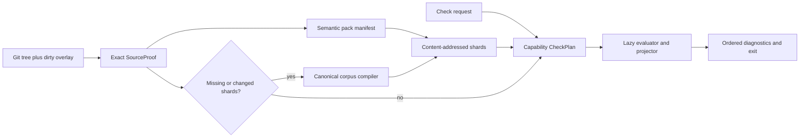

# TODO: Verified semantic build products for true cold latency

Status: proposed roadmap

Related decision: [V2-REV-027](.history/v2/revisions/V2-REV-027.md)

## Thesis

`cg check` should query a verified semantic build product. It should not construct the complete
semantic world on every request.

A truthful workspace-cold start below three seconds is achievable when an exact, portable semantic
pack is supplied to an otherwise empty Codegraph cache. A source-only genesis build below three
seconds is a distinct and harder goal. Both must remain visible, and both must preserve the canonical
compiler and source snapshot as semantic authority.

The work is therefore a production/consumption redesign around the existing immutable generations,
not a semantic rewrite:

> Preserve the compiler and source as authority; make their results portable, proof-carrying,
> query-planned build products.

## Baseline and problem statement

The investigated cold path was:

```text
process start
-> prove complete repository inventory
-> discover every specification
-> compile the entire specification corpus
-> compute repository-wide statistics
-> only then apply module selection
-> observe layout, schema, and tests
-> qualify profiles
-> render diagnostics
```

The retained Kernel evidence records:

- 184 seconds for the cold whole CLI path.
- 162 seconds for the canonical in-memory cold path.
- 1.205-1.545 seconds for five fresh-process warm whole checks.
- A complete compact check catalog of 59,543 compressed bytes and 995,343 decoded bytes.
- The CLI check path sets `compilerAnalysis: false`, so native ttsc/project analysis was not the
  cause of this baseline.
- 326 specification anchors and 357 unique API, internal, and port declaration entrypoints in the
  investigated corpus.
- Four declaration entrypoints per isolated compiler batch, implying 90 initial Node worker batches
  for that corpus, potentially more after retries.
- TypeScript analysis grouped in batches of 32, implying at least eleven additional programs for
  326 modules in the investigated implementation.
- A sequential statistics pass that reread admitted text even though statistics did not contribute
  to visible `cg check` diagnostics.
- Module selection occurred only after whole-corpus compilation and statistics.

See the retained [restart evidence](.history/v2/evidence/cli-restart-kernel-2026-08-17.summary.json).
It proves the magnitude and the compactness of the read/projection product, but it does not retain
enough phase timing to assign an exact percentage of the 162 seconds to compilation. Worker and
program counts identify the strongest structural bottleneck; they are not a fabricated timing
attribution.

V2-REV-027 and its implementation already establish advisory checkpoints, immutable generations,
content-addressed derived artifacts, exact owner/dependency deltas, and fail-closed fallback. This
roadmap extends that foundation to a portable semantic product and a request-planned check path.

## First-principles contract

Let:

- `S` be the exact source snapshot, including relevant directory topology.
- `E` be the exact engine, producer, profile, configuration, and schema identities.
- `R` be the normalized check request.
- `F(S, E, R)` be the canonical result: ordered output, exit status, and semantic identities.

Today, cold work is approximately:

```text
T_cold =
  T_boot
+ T_inventory(all paths and bytes)
+ T_discovery(all specifications)
+ sum(T_compile(specification))
+ T_statistics(all admitted text)
+ sum(T_observe(specification))
+ sum(T_qualify(specification))
+ T_render
```

The target is:

```text
T_check =
  T_boot
+ T_source_attestation
+ T_pack_open
+ T_request_plan
+ sum(T_recompute(cache misses in affected closure))
+ T_render
```

For an unchanged exact pack, the affected closure is empty. Runtime should then be dominated by
boot, source attestation, bounded pack reads, and requested output rather than total repository size.

There is a hard boundary: without a prior Merkle root, filesystem journal, Git tree, or semantic
artifact, an exact algorithm must inspect every input that could change the result. Source-only
`<3s` cannot be guaranteed for an unbounded repository. A Git Merkle tree plus an exact dirty overlay
can make admission proportional to the changed set rather than total repository size.

## Target data flow



## Invariants and non-goals

- [ ] Preserve source plus the canonical compiler as semantic authority.
- [ ] Treat every checkpoint and semantic pack as untrusted acceleration.
- [ ] Make a missing, stale, corrupt, incompatible, oversized, or incomplete artifact an explicit
      miss; never allow it to fabricate a pass.
- [ ] Keep source-only genesis performance visible even after workspace-cold performance graduates.
- [ ] Do not require a daemon for machine-cold or workspace-cold correctness.
- [ ] Do not start with a Rust/native rewrite. First remove repeated work and profile the remaining
      CPU cost.
- [ ] Do not change semantic or data-model behavior in the performance path.

## Phase 0: Freeze the oracle and retain causal measurements

- [ ] Define candidate equivalence as:

  ```text
  candidate(S, E, R) == canonical_no_pack_no_cache(S, E, R)
  ```

- [ ] Compare byte-ordered stdout and stderr, exit status, failure identity, inventory/source root,
      specification identities, observation identities, qualification identities, generation and
      shard roots, and selection/support/dependency closure.
- [ ] Retain wall time, CPU time, bytes read and hashed, directories traversed, compiler worker
      count, TypeScript program count, specifications compiled/observed/qualified, shards loaded and
      written, decoded bytes, and peak RSS.
- [ ] Preserve phase timings in qualification evidence rather than exposing transient counters only.
- [ ] Freeze whole, leaf, dependency-heavy subtree, and multi-select workloads.
- [ ] Freeze valid and diagnostic mutations covering add/delete/rename/revert, `.spec` anchors, API,
      ports, packages, config, layout, test evidence, dirty/untracked paths, and A -> B -> A branch
      sequences.

## Phase 1: Admit an exact `SourceProof`

Add a repository/workspace attestation layer that proves:

- [ ] Git tree identity for tracked clean content.
- [ ] Exact dirty tracked and untracked overlay.
- [ ] Relevant directory topology, including meaningful empty directories.
- [ ] Symlink, case-sensitivity, and file-kind behavior.
- [ ] Producer, package, profile, configuration, and schema identities.
- [ ] TOCTOU stability while the snapshot is admitted.

Metadata and filesystem journals may narrow candidates, but every changed or uncertain candidate
must be content-hashed. Journal overflow or uncertainty must widen visibly to a full scan. This
extends exact inventory; it never replaces source authority.

## Phase 2: Publish a proof-carrying semantic pack

Define an immutable DAG containing independently content-addressed products:

- [ ] Source/input manifest.
- [ ] Per-module `SpecificationSnapshot` shards.
- [ ] Ownership and reverse-dependency index.
- [ ] Layout, schema, and test-observation shards.
- [ ] Qualification shards.
- [ ] Exact analysis generation references.
- [ ] Optional compact check projection.
- [ ] Component-level producer fingerprints.

Each shard key must commit to its semantic inputs:

```text
H(
  artifact kind,
  schema version,
  exact producer component,
  exact input shard digests,
  qualification profile
)
```

Admit a pack only when:

- [ ] Source attestation matches exactly.
- [ ] Every required producer, profile, configuration, and schema identity matches.
- [ ] Referenced artifacts verify their content digest and decoded bounds.
- [ ] The manifest proves the complete request closure.
- [ ] Semantic identities recompute correctly.

Otherwise, record a miss and run the canonical compiler. Publication must be atomic; interrupted or
concurrent publishers must never expose a partial product.

## Phase 3: Plan checks by capability

Replace the monolithic application binding with an explicit request plan. The default check should
request only:

```text
CheckPlan(default check) =
  specification validity
+ requested layout mode
+ schema catalog
+ test evidence
+ selected dependency closure
```

- [ ] Make repository statistics an independent capability.
- [ ] Make viewer source presentation an independent capability.
- [ ] Make implementation analysis an independent capability.
- [ ] Let server/viewer consumers request those capabilities without imposing them on `cg check`.
- [ ] Make selection and closure planning possible before unrelated repository-wide projection.
- [ ] Version application identity deliberately when capability membership changes; do not retain an
      old identity contract while silently dropping statistics or another component.

## Phase 4: Build a real whole-corpus compiler

Optimize the source-only and pack-miss path behind the same canonical interface:

- [ ] Replace process churn with one memory-bounded isolated corpus worker, with isolated fallback
      for modules proven unsafe by the existing ambient-effect analysis.
- [ ] Share files, ASTs, and module resolution across declaration entrypoints.
- [ ] Use one or a small number of TypeScript programs partitioned only by proven semantic context.
- [ ] Project API, internal, and port results from the shared semantic session.
- [ ] Unify declaration extraction and module-reference analysis over the same compiler state where
      semantic equivalence is proven.
- [ ] Observe layouts from the admitted inventory rather than rescanning every module root.
- [ ] Share parsed test evidence by source digest.
- [ ] Evaluate specification-local qualification shards in bounded parallel batches.
- [ ] Keep exact counters for compiler sessions, programs, fallbacks, inputs, and affected closure.

Competing pack/storage implementations may be evaluated as controlled black boxes—such as bounded
Brotli JSON, read-only SQLite, a compact binary format, or a memory-mapped index—but each must consume
the same source snapshot and equal the same canonical result.

## Phase 5: Qualify honest cold classes

Freeze these terms and report them separately:

| Class | Starting state | Target |
| --- | --- | ---: |
| C0 result replay | Exact request transcript already exists | `<1s` aspirational |
| C1 workspace-cold | Empty Codegraph cache; matching semantic pack supplied | every run `<3s` |
| C2 delta-cold | Previous exact pack plus ordinary edit | every owner-bounded run `<3s` |
| C3 genesis | Source only; no pack anywhere | separate gate; ultimately `<3s` on governed Kernel |

C1 is the product cold-start contract. Pack production belongs in checkout/install, CI artifact
hydration, release packaging, or an existing development lifecycle—not inside the timed command.
Solving C1 permits the claim "cold start solved," not "cold build solved."

### Portable-pack qualification

- [ ] Start with an empty workspace cache.
- [ ] Supply a read-only pack produced by a separate process at a different absolute path.
- [ ] Prohibit any prior `cg check` request from priming the workspace.
- [ ] Verify exact source, producer, schema, profile, and pack provenance before timing.

### Anti-gamed latency gate

- [ ] Run 100 fresh operating-system processes across multiple fresh runners.
- [ ] Use no priming and interleave request shapes.
- [ ] Require every C1 sample below 3000 ms and p95 below 2500 ms.
- [ ] Include hidden mutation and repository holdouts.
- [ ] Require exact oracle equality before considering latency.
- [ ] Checksum-bind raw argv, PID, timestamps, hardware, hashes, pack provenance, and causal counters.
- [ ] Have an independent verifier recompute the evidence rather than trust its summary.

### Fail-closed qualification

- [ ] Wrong source root.
- [ ] Producer, profile, configuration, or schema drift.
- [ ] Missing, corrupt, oversized, truncated, or cyclic shards.
- [ ] Concurrent publishers and aborted publication.
- [ ] Journal overflow and incomplete changed-path hints.
- [ ] TOCTOU mutation during admission.

Recovery may have its own latency classification, but it must always produce the canonical outcome.

## Phase 6: Consolidate after graduation

- [ ] Consolidate CLI result caching, application checkpoints, and semantic packs around one shared
      content-addressed store instead of maintaining overlapping persistence models.
- [ ] Retain the canonical slow compiler as oracle and recovery path.
- [ ] Remove obsolete repository-sized JSON hydration and worktree-path coupling.
- [ ] Keep terminal transcript memoization only as a final projection optimization.
- [ ] Replace monolithic executable fingerprints with exact component fingerprints without weakening
      admission.
- [ ] Remove stale formats and dead migration code only after negative scans and restart
      compatibility tests.
- [ ] Re-run warm, incremental, server, and viewer qualification to prove cold improvements do not
      regress already-qualified behavior.

## Definition of done

- [ ] C1 workspace-cold satisfies the exact equality and latency gates on the governed Kernel corpus.
- [ ] C2 delta-cold satisfies exact owner/dependency closure equality and latency gates.
- [ ] C3 genesis has a separately reported, reproducible full-build gate with causal measurements.
- [ ] Corrupt, stale, incomplete, or incompatible acceleration always fails closed to canonical work.
- [ ] A portable pack works from a different absolute path with an empty local Codegraph cache.
- [ ] Performance evidence distinguishes source attestation, pack open, planning, recomputation, and
      rendering rather than reporting only whole-command time.
- [ ] Documentation and CLI output use the C0-C3 terminology without conflating cold start and cold
      build.
