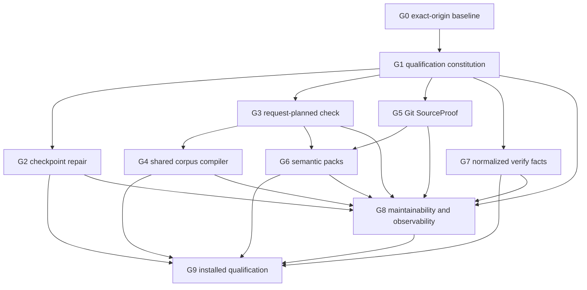

# Codegraph latency program

Status: active execution DAG

Governing decision: [V2-REV-028](.history/v2/revisions/V2-REV-028.md)

## Goal

Make `cg check` and `cg verify` state-of-the-art on the governed Kernel corpus on warm, workspace-
cold, delta, and source-only starts without weakening any capability, diagnostic, identity, failure,
selection, or security contract.

The acceptance oracle is immutable:

```text
optimized(S, E, R) === canonicalSlow(S, E, R)
```

Equality covers byte-ordered stdout and stderr, exit status, typed failure, source/inventory proof,
application and qualification identities, diagnostics and ordering, selection/primary/support/
dependent closure, fact and shard roots, and externally visible effects. Timing and physical cache
representation are deliberately excluded.

## DAG



G2, G3/G4, G5/G6, and G7 are independent branches after G1. If one branch encounters a classified
blocker, work continues on another ready branch. Every branch keeps the canonical miss path and can
be reverted independently.

## Execution protocol

Each node moves through `not-started -> baseline -> implementing -> focused-qualified -> corpus-
qualified -> complete`. A node may instead become `split` or `superseded`; it is never declared
complete because a timeout, memory limit, or test was removed.

Before editing a node:

1. pin Codegraph and Kernel commits, worktree status, installed package digest, platform, and
   harness digest;
2. name the semantic owner, proof-loss boundary, consumers, and governing contracts;
3. capture production physical LOC, file/directory counts, large-file distribution, and repeated
   boundary guards for the affected slice;
4. run the focused canonical baseline and retain raw evidence; and
5. freeze the node's capability manifest and oracle workloads outside candidate control.

After editing a node:

1. run owner types and focused deterministic/fault tests;
2. run optimized and forced-canonical paths from the same admitted source snapshot;
3. compare semantic receipts before evaluating performance;
4. run the node's latency, work-counter, memory, and representation gates;
5. inspect the focused diff, import direction, LOC/guard delta, and unrelated worktree state; and
6. retain a self-hashed receipt plus an independently recomputed verification receipt.

### Loop breaker

An identical failing command may be repeated once only to classify noise. A third attempt requires
one of: a code/configuration change, a smaller reproducer, new instrumentation, a different bounded
implementation, or an explicit external-state recovery condition. Otherwise the node is split and
the next ready DAG node proceeds. Performance noise never permits threshold changes from the same
candidate run.

### Fallback taxonomy

Every fallback has a stable code and causal counters:

- `proof-unsupported`: source proof cannot be established; run complete scanner;
- `proof-unstable`: input changed while being read; retry admission once, then full scan;
- `plan-uncertain`: exact owner/dependency closure is unknown; run complete compiler;
- `compiler-isolated`: owner cannot share safe compiler state; run isolated canonical compilation;
- `pack-miss`: source, producer, configuration, profile, schema, closure, digest, or bound mismatch;
- `checkpoint-unavailable`: checkpoint load or publication failed; run or retain canonical result;
- `verify-staging-miss`: staged manifest cannot be admitted; rebuild canonical bounded shards.

Fallback frequency is a gate. A candidate cannot meet latency by silently returning replayed output,
skipping work without proof, or classifying ordinary inputs as unsupported.

## G0 — Exact-origin baseline

Dependencies: none.

- [x] Fetch Codegraph origin and prove no remote branch is ahead of `origin/main`.
- [x] Leave the intentionally dirty primary Codegraph and Kernel worktrees untouched.
- [x] Create an isolated branch from exact Codegraph `origin/main`.
- [x] Pin the exact Kernel `origin/main` and installed Codegraph producer.
- [x] Record selected cold, selected replay, private-edit, whole cold, whole replay, and selected
      verify timings.
- [x] Attribute selected cold phases and the verify transaction bound.
- [x] Retain baseline complexity and capability manifests in a machine-readable qualification
      fixture.

Exit: exact commits, worktree evidence, raw measurements, capability manifest, and complexity
baseline are independently reproducible.

## G1 — Qualification constitution

Dependencies: G0.

- [x] Ratify V2-REV-028 and the immutable canonical oracle.
- [x] Define one versioned semantic receipt shared by canonical and optimized runners.
- [x] Add independent receipt verification that ignores candidate summaries and requires a counted
      owner-isolated canonical execution rather than trusting the receipt mode label.
- [x] Freeze check workloads: whole, leaf, dependency-heavy, multi-select, valid, and diagnostic.
      Receipt v3 binds exact Kernel `bfe6be8e7`, constitution digest, selectors, flags, expected
      outcomes, and canonical owner bounds; shape-equivalent relabeling fails before timing.
- [x] Make the C1 verifier require canonical coverage for whole, at-most-25-owner leaf,
      at-least-100-owner dependency-heavy, multi-select, valid, and diagnostic workloads before
      evaluating timing. The ratified selector lock now owns the visible governed set; independent
      hidden holdouts remain outside candidate control for G9.
- [x] Freeze mutations: private docs, API, ports, package authority, config, layout, test evidence,
      create, delete, rename, revert, dirty/untracked/ignored, symlink, mode, and A -> B -> A.
      The constitution freezes all 17 mutation classes; execution remains a G9 graduation gate.
- [x] Freeze failure cases: corruption, truncation, oversize, concurrency, cancellation, TOCTOU,
      missing producer, missing closure, and unreadable source.
      The constitution freezes all nine failure classes; execution remains a G9 graduation gate.
- [x] Require exact equality before any timing predicate is evaluated.
- [x] Record wall/CPU time, bytes traversed/read/hashed/decoded, compiler sessions and programs,
      compiled/observed/qualified owners, loaded/written shards, fallbacks, and phase timings. The
      receipt-v3 vector is now derived from raw Git/application/compiler/codec events and
      independently recomputed. Each declaration worker must self-report its exact Node peak RSS;
      qualification gates the conservative sum of parent, worker-maxima, and native peaks. This
      cross-platform upper bound can overestimate non-overlap but cannot undercount residency.

Exit: qualification can fail a semantically different fast result even when the result is under its
latency target, and can fail a slow result even when it self-reports compliant counters.

## G2 — Observable application checkpoint incrementality

Dependencies: G1.

- [x] Omit absent optional diagnostic fields before checkpoint representation.
- [x] Add a diagnostic-rich checkpoint round-trip reproducing the Kernel failure.
- [x] Replace telemetry-only publication failure with a typed lifecycle publication receipt.
- [x] Preserve advisory semantics: cache failure does not change canonical diagnostics or exit.
- [x] Make focused application qualification require a valid published checkpoint and successful
      reopen; wire the same assertion into retained corpus qualification before G2 completion.
- [x] Add focused fault tests for serialization and store rejection; cancellation and concurrent
      replacement remain covered by the generic checkpoint store suite.
- [x] Gate one private `.spec` documentation edit below 5 seconds with exactly one owner compiled,
      observed, and qualified and zero unrelated artifact rewrites.
- [x] Graduate the same case below 3 seconds after checkpoint repair; retain it through G3/G4.

Exit: the original undefined-field reproduction publishes and reopens; every publication failure is
attributable; the private-edit receipt equals independent cold semantics and satisfies causal and
latency gates.

## G3 — Request-planned cold check

Dependencies: G1.

- [x] Split cheap anchor/ownership/dependency discovery from normative compilation.
- [x] Resolve normalized request, owner selection, and support closure before unrelated compilation;
      dependent expansion deliberately retains the complete fallback until reverse edges are indexed.
- [x] Compile, observe, and qualify only the required closure.
- [x] Introduce application capabilities and stop requesting repository statistics from ordinary
      `cg check`; retain exact statistics for viewer/report consumers.
- [x] Bind capabilities into request and application identity.
- [x] Make dependent-expansion and uncertain closure evidence visibly widen to a complete canonical
      check; add stable fallback receipts before G3 completion.
- [ ] Differentially qualify whole, leaf, dependency-heavy, multi-select, invalid selection, and
      diagnostic owners.

Exit: selected cold work counters are proportional to the exact selected/support closure, ordinary
check performs zero statistics analysis, and all outputs equal forced-canonical output.

## G4 — Bounded shared corpus compiler

Dependencies: G3.

- [x] Inventory current worker batches and add declaration/TypeScript/snapshot phase attribution;
      parsed-file, resolution-read, and retry counters remain.
- [ ] Define a correctness-owned compiler-session interface independent of pooling mechanics.
- [x] Put private isolation batching in owner-local `*.optimization.ts`; persistent session reuse and
      memoization remain.
- [x] Reuse source text, ASTs, module resolution, and compatible compiler programs across owners;
      declaration and implementation stages remain separate universes.
- [x] Retain a fresh-process one/two/four integrated-universe experiment: all variants construct the
      same 609 unique sources once and preserve exact export/diagnostic digests; one universe is
      fastest at 669 ms for the selected 537-root corpus.
- [x] Preserve isolation for ambient-effect or incompatible-context owners with a counted fallback.
- [x] Execute the explicit binding decision experiment: two minimal modules agree, while latest
      Kernel `core/schema` exposes branded-identity mismatches and five implementation exports absent
      from its authoritative specification; retain the current verifier. Root-scoped TypeScript
      diagnostics are exactly equal for binding roots and reduce that phase from 2.62 s to 10.69 ms
      in a fresh bounded prototype.
- [x] Prove request-planned compilation equals full-corpus projection on focused fixtures and the
      selected Kernel oracle; retain shared/isolated fault equality before G4 completion.
- [ ] Requalify bounded concurrency, memory, cancellation, and process cleanup on latest Kernel.
      One-at-a-time/one-resident routing and the typed 768 MiB native watchdog pass focused tests,
      but latest `core/schema` alone exceeds ten seconds in the legacy surface extractor and one
      serial project reached 2.35 GiB before an operator stop. No V1/canonical run is permitted
      until this leaf passes the watchdog. Schema-v2 composition no longer reconstructs repeated
      declaration closures merely to preserve logical fact identities, and a focused fixture proves
      exact logical and physical identity equality. A direct one-core latest-Kernel probe still
      times out after ten seconds inside transitive declaration normalization: Program open is
      155 ms, export enumeration is 149 ms, 128 declarations complete, and 123 remain pending.
- [ ] Graduate selected C3 below 3 seconds against the owner-isolated canonical path. On latest
      Kernel `bfe6be8e7`, two fresh source-only optimized receipts complete in 2.755 s and 2.728 s,
      compile exactly the selected 29 owners plus 140 support owners, start no native compiler, and
      produce identical terminal output. The target is met on the optimized side, but graduation
      remains open because the resource-conservation constraint precludes another multi-minute
      latest-source canonical replay.

Exit: one bounded shared session is the ordinary path, isolated fallback is rare and attributable,
and C3 meets the hard target or has a retained causal lower-bound receipt that identifies the next
splittable leaf without redefining C3.

## G5 — Git-backed SourceProof

Dependencies: G1.

- [x] Add a tiny receiver-bound Node Git executable adapter; portable layers see only opaque proof
      and changed-path evidence.
- [x] Bind repository format, Git object format, `HEAD^{tree}`, source-scope version, and a sorted
      Codegraph-digested dirty overlay.
- [x] Parse `git status --porcelain=v2 -z --untracked-files=all --ignore-submodules=none --no-renames`.
- [x] Preserve creates, updates, deletes, symlinks, and executable modes; dirty submodules visibly
      fall back while clean gitlink identities remain tree-bound.
- [x] Re-stat before/after dirty reads and reject unstable evidence.
- [x] Define ignored semantic input policy and bind meaningful directory topology explicitly.
- [x] Fallback visibly for conflicts, sparse/unsupported worktrees, unreadable files, dirty
      submodules, uncertain parsing, and mutation.
- [x] Differentially compare clean, dirty, ignored, excluded, cancellation, and relocated proof
      admission, including conflict, sparse, unreadable, dirty-submodule, and two-attempt
      mutation-race fallback.

Exit: clean admission is independent of repository file count after Git has proved the tree; dirty
admission hashes only exact overlay candidates; every uncertainty runs the complete scanner.

## G6 — Portable semantic packs

Dependencies: G3 and G5.

- [x] Define content-addressed manifest and bounded independent shards for ownership,
      specifications, observations, qualifications, optional analysis, and compact check output.
      Semantic-pack v2 commits the compact result/catalog plus the application manifest DAG; its
      explicit check plan excludes compiler analysis and schema roots, so no unused optional
      analysis shard is part of this command's complete closure.
- [x] Deliver the compact check-output shard as the first independently gated pack slice.
- [x] Publish a SourceProof-bound whole-check catalog shard and consume it read-only in an empty
      local cache to answer another selected request through the canonical selection projection,
      with byte-exact terminal and exit parity and zero application construction.
- [x] Bind SourceProof, producer components, configuration, profiles, schema, and capability plan.
      The ordered four-profile check plan, empty capabilities/schema roots, and disabled compiler
      analysis are explicit manifest-v2 identity; drift misses before any result shard load.
- [x] Validate every digest, decoded bound, identity, and complete request closure before use.
      The shared store validates selected descriptors/digests and decoded limits, while application
      projection admits the manifest-owned selected/support closure and exact API payloads only.
- [x] Add manifest-only and exact artifact-key admission to the shared content-addressed store so a
      future pack planner can validate and read only its requested closure; eager callers retain
      their existing behavior and omitted artifacts are never represented as admitted evidence.
- [x] Bind the existing sharded application checkpoint to SourceProof, commit its canonical manifest
      digest from the semantic-pack root, and restore it read-only after a compact-shard miss with
      zero compilation and no supplied-store mutation. A non-exact focused restore now admits the
      corpus index first and reads only the exact selected/support specification and API-payload
      closure; an omitted corrupt owner remains unread. Optional analysis is deliberately absent
      from the bound check plan rather than eagerly serialized.
- [x] Publish one atomic manifest after all shards exist; handle concurrency and interruption.
      Exact result and catalog share one atomic semantic root committed only after the referenced
      application manifest DAG exists. Concurrent/interrupted root replacement, selected closure,
      omitted corruption, and manifest-plan drift are all fault-qualified.
- [x] Fault-qualify the semantic root itself: exact identity mismatches miss, malformed application
      references are rejected before result exposure, concurrent publishers expose one internally
      consistent result, and an interrupted replacement preserves the prior complete root.
- [x] Produce compact check output in one process/path and consume it read-only from another path
      with an empty local cache, including explicit `CI=true` admission.
- [x] Retain the canonical compiler and publish a compact replacement only after successful
      canonical work.
- [x] Implement an independent C1 series verifier that requires 100 receipt-v3 processes, at least
      two equivalent runner instances, balanced/interleaved whole, leaf, dependency-heavy, and
      multi-select request shapes, both valid and diagnostic outcomes, exact per-shape canonical
      equality before timing, every sample below 3 seconds, and p95 below 2.5 seconds. Corpus
      execution remains part of G9 and cannot be proxied by its synthetic test.
- [ ] Consolidate overlapping checkpoint storage only after pack graduation.

Exit: C1 runs in 100 fresh processes/runners, every sample below 3 seconds and p95 below 2.5
seconds, with no prior request prime and exact canonical receipts. C0 remains below 1 second.

## G7 — Normalized and staged verify facts

Dependencies: G1.

- [x] Measure unique declaration payloads, repeated embeddings, module fanout, and allocation peaks.
- [x] Store declarations once as content-addressed shards and reference IDs from module facts.
- [x] Preserve the unchanged logical module fact identity with a streaming canonical preimage; do
      not rebuild the repeated schema-v1 declaration monolith behind schema-v2 shards. Retain an
      exact physical-fact digest comparison against the pre-optimization normalized producer.
- [x] Preserve public API closure, declaration provenance, stable identity, ordering, and query
      results under a compatibility-qualified projection.
- [x] Project requested module owners on cold runs and exact affected owners on incremental runs.
- [x] Stream/stage bounded physical and semantic shards; atomically publish one manifest.
- [x] Keep the 384 MiB semantic response limit and all per-frame/physical limits.
- [x] Fault-test missing/reordered/corrupt/duplicate/oversized shards, cancellation, and commit-late;
      bind the reader, bounded-frame, cancellation, atomic-publication, and store-acknowledgement
      cases to stable specification evidence IDs.

Exit: V0 selected, V1 whole, and V2 incremental all complete below existing bounds, exact queries
equal canonical normalized facts, and no one-shot transaction approaches the global corpus size.

## G8 — Maintainability and observability ratchets

Dependencies: G1 and every implemented branch node.

- [x] Freeze a repository-owned baseline of production physical LOC, source files, directories,
      largest files, size bands, import cycles, and repeated guards/decoders.
- [x] Reject regressions beyond explicit per-slice budgets; candidate code cannot rewrite baseline.
- [x] Prefer focused nested owners and small cohesive files; reject empty wrappers and dense LOC
      gaming.
- [x] Require performance mechanics in `*.optimization.ts` where separable.
- [x] Enforce correctness owner -> owner-local optimization dependency through an exact ratified
      import allowlist; prohibit every unratified concrete optimization import. A registration or
      composition-root framework was rejected because it adds mutable indirection and startup work
      without strengthening the private semantic boundary.
- [x] Require stable failure/fallback families, phase spans, causal counters, and publication
      receipts. The governed boundary gate pins existing protocol/resource messages, SourceProof,
      semantic-pack, compiler isolation, and checkpoint miss families; receipt-v3 and focused fault
      suites retain the phase/counter/publication evidence.
- [x] Check no silent catch at persistence, compiler, protocol, pack, and source-proof boundaries.
      The AST gate rejects empty catches, erased error bindings, and bare catches without an exit or
      explicit diagnostic/advisory/concurrency/fallback rationale across the exact boundary list.
- [x] Retain before/after physical LOC and repeated guard counts for every refactor slice.

Exit: architecture tests and retained receipts make complexity, dependency direction, silent
failures, and counter omissions blocking regressions without rewarding fragmentation.

## G9 — Installed exact-SHA graduation

Dependencies: G2, G4, G6, G7, and G8.

- [ ] Build and pack Codegraph from exact branch SHA.
- [ ] Install into a clean exact Kernel `origin/main` worktree without touching the primary tree.
- [ ] Run C0/C1/C2/C3 and V0/V1/V2 with hidden holdouts and independent receipt verification.
- [ ] Run owner types, focused tests, complete Codegraph tests, governance, package/install tests,
      self-hosting, and Kernel plan-derived applicable checks.
- [ ] Confirm no remote Codegraph branch advanced the delivery base; rebase and rerun affected gates
      if it did.
- [ ] Inspect final diff, complexity deltas, generated/package contents, and retained evidence.
- [ ] Report semantic status separately from latency status and current Kernel diagnostics.

Exit: all classes pass from the stated starting states on exact SHAs; no limit, capability, test, or
diagnostic was weakened; receipts and reproduction commands are retained.

## Current baseline

Codegraph: `16aca70db070aac335d0aa4ef9c07eafea91ee74` (`origin/main` at admission).

Kernel: `a19601a15be360df89be52ec54bdbf7867248372` (`origin/main` at admission).

Latest refreshed qualification Kernel: `bfe6be8e7964f3d9d8b0b9d932802bd4d1cd740b`
(`origin/main`, two commits after the last complete matrix).

| Journey | Result |
| --- | ---: |
| selected backend cold check | 85.50 s |
| selected backend identical replay | 0.89 s |
| private spec documentation edit after prime | 84.78 s |
| whole cold check | 100.69 s |
| whole identical replay | 0.71 s |
| selected backend verify | 899.74 s then 598.95 MiB / 384 MiB rejection |

The last complete exact matrix remains the retained `b2221a4e1` evidence and is not represented as
current. On `bfe6be8e7`, selected verify exposed unsafe eager native residency: five projects
completed, the sixth was killed by the operating system, and no V1 or canonical run was started.
Serial lifecycle then isolated the problem to `core/schema/tsconfig.json`: that one project reached
about 2.35 GiB after 161 seconds, while a one-owner projection still exceeded a ten-second hard
timeout. The plain compiler control lists 660 files in 0.82 seconds, so the legacy independent
implementation-surface projection—not TypeScript Program construction—is the failing leaf. Future
qualification uses a typed 768 MiB native-PID watchdog and cannot claim success without
peak-residency evidence.

The explicit binding prototype gives the forward path without deciding the migration prematurely.
For `core/schema`, a fresh root-only run completes in 2.05 seconds at 446.83 MiB; targeted compiler
diagnostics cost 10.69 ms and are exactly equal to whole-program diagnostics for the binding roots.
Independent assignability still costs 926 ms and misclassifies branded identities, so it is not a
replacement oracle. Exact export enumeration also finds five real implementation names absent from
the authoritative `.spec`: `AuthorityOperation`, `AuthorityOperationOrder`, `AuthorityOperations`,
`AuthorityRelation`, and `operationOf`.

The latest Kernel currently has independent conformance diagnostics. Performance receipts compare
optimized and canonical results at the same source state; they never relabel those diagnostics as a
Codegraph performance failure or hide them to obtain a pass.

Latest source-only C3 evidence is now materially better than the retained `b2221a4e1` matrix. On
`bfe6be8e7`, clean Git-tree admission avoids the complete scanner, bounds ignored-path evidence to
31 directory candidates, and retains the same SourceProof identity. Declaration compilation stays
in minimum-compatible Programs, module TypeScript stays in its faster stage-local Program, and
TypeScript preparation overlaps immutable snapshot resource loading. Two independently self-hashed
runs complete in 2.755 s and 2.728 s at 616.74 MiB and 609.64 MiB parent RSS. This is optimized
target evidence only: the latest canonical pair remains deliberately pending rather than being
proxied by older evidence or a semantic pack.
