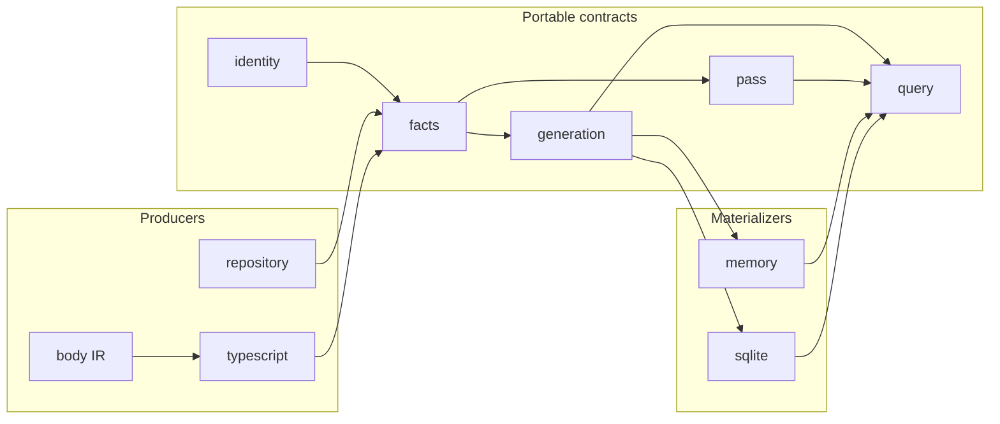
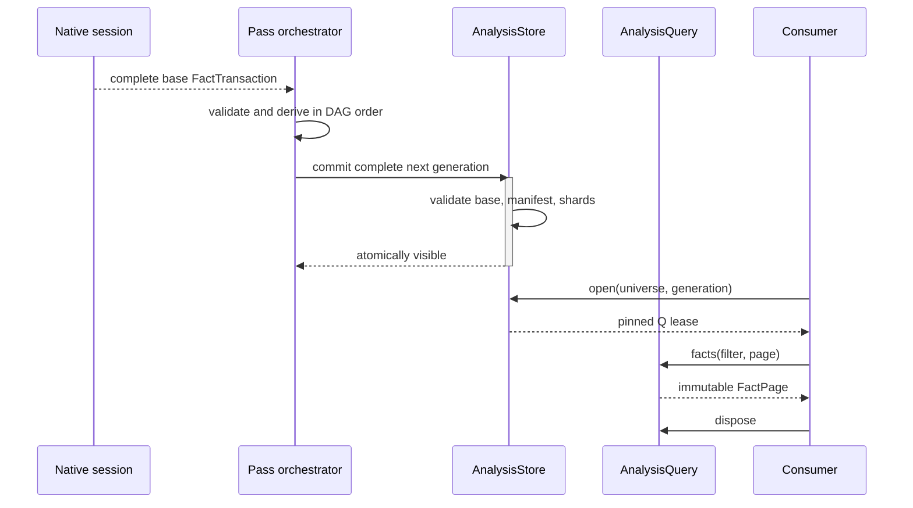

# Headless semantic analysis

Analysis is a reusable evidence engine, not a TypeSpec verifier. Compiler-near producers and
portable passes publish immutable facts; materializers commit complete generations; consumers hold
generation-pinned query leases.

Import direction points from each consumer to the owner it needs. The public `analysis` module is a
structural facade; it owns no mutable singleton, store selection, process lifecycle, or TypeSpec
policy.

The following are distinct contracts:

- identity owns portable equality and never embeds an absolute checkout path;
- facts own evidence, provenance, and epistemic completeness;
- generation owns complete manifests and optimistic transaction bases;
- pass owns dependency planning and mandatory/optional failure semantics;
- query owns snapshot leases and bounded access; and
- source owns digest-verified text access without persisting source bodies; and
- memory and SQLite implement one `AnalysisStore` contract without leaking backend types.

An `AnalysisSnapshotSet` pins both the exact repository inventory revision and every included
universe generation. Portable output shards name the semantic capabilities whose completeness they
bound; capability and namespace names need not match. Unaffected portable output is carried from
validated in-memory shards without fact export, pass execution, or immutable-row rewrite.

The filesystem mirrors this authority graph as a hierarchical module tree. Each capability owner
keeps a small, mostly flat collection of cohesive files; another directory level is justified only
by a separately reusable subdomain, lifecycle, protocol, or backend. Generic horizontal buckets
and catch-all helpers are rejected because they erase dependency direction rather than simplify it.

Shard content digests omit only the enclosing generation field from each fact. The manifest of
those semantic shard digests determines the generation identity, after which transaction validation
binds every fact to that exact generation. Fact IDs are row keys inside a generation-pinned query;
there is no recursive digest construction.

Generation identities stream the same canonical v1 preimage in bounded chunks. A weak cache
reuses encodings of immutable flat manifest references; custom accessors, nested mutable data
and toJSON behavior retain the generic canonicalizer. Complete hashing still visits every
manifest byte, while an unchanged retained reference needs no new canonical object graph.

The memory materializer keeps generation-neutral facts in an ordered persistent index. A delta
updates only the facts in replaced or deleted shards, their existing secondary postings, and their
completeness contributions. Both primary indexes and individual posting buckets share untouched
tree branches; a large namespace bucket is never copied to apply one changed fact. A new snapshot
owns its tree roots directly, without retaining a chain of previous snapshots or query leases.

Generation-pinned query views bind and memoize only requested fact envelopes. Opening another
generation therefore does not copy every carried fact, sort the complete population, or recreate
headers for unselected facts. Sorted iteration and merging preserve exact filters, pagination,
totals, and generation-bound cursors. The first use of a secondary field indexes it once; later
revisions carry its unchanged postings. Queries opened only after an unobserved lineage may build
their initial index from the current immutable shards.

Completeness is maintained from counted shard and fact contributions, including partial reasons
temporarily masked by unavailable evidence. Removing a contribution restores the remaining exact
state. Shard capability declarations are counted by namespace so a fact's completeness still
bounds every capability declared by any retained shard in that namespace. These indexes are
published only after transaction validation, and carry no mutable producer-owned data.
