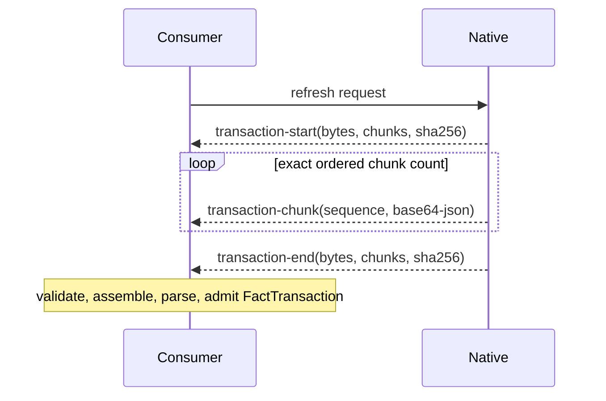

# Native analysis protocol

The protocol adapter owns a bounded JSONL trust boundary between a resident native analyzer and
portable JavaScript consumers. The native process may keep compiler objects private, but every
consumer-visible result is a validated `NativeAnalysisResponse`.

Small transactions use one terminal `transaction` frame. A transaction that does not fit the
configured frame ceiling is encoded as canonical JSON and transported through an integrity-checked
sequence:

Chunking is a wire concern only. It does not create partially visible generations, expose a native
wire type to analysis consumers, or change the atomic fact-transaction contract. A missing,
duplicate, reordered, oversized, malformed, or digest-invalid frame fails the session without
publishing a response.
