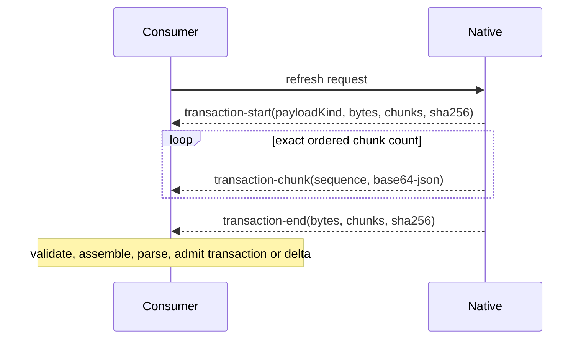

# Native analysis protocol

The protocol adapter owns a bounded JSONL trust boundary between a resident native analyzer and
portable JavaScript consumers. The native process may keep compiler objects private, but every
consumer-visible result is a validated `NativeAnalysisResponse`.

Small cold transactions use one terminal `transaction` frame. Incremental analysis uses a `delta`
containing only affected shard upserts and deletes; the consumer reconstructs and validates the
complete manifest against its pinned base. A payload that does not fit the
configured frame ceiling is encoded as canonical JSON and transported through an integrity-checked
sequence:

Chunking is a wire concern only. It does not create partially visible generations, expose a native
wire type to analysis consumers, or change the atomic fact-transaction contract. A missing,
duplicate, reordered, oversized, malformed, or digest-invalid frame fails the session without
publishing a response.

Native publication is commit-late. The process retains one replayable candidate until the
application store commits the reconstructed transaction and acknowledges its exact generation and
sequence. A failed validation, cancellation, or store commit cannot advance the resident generation.

Diagnostic telemetry is opt-in and never enters semantic stdout. Unix hosts retain descriptor 3;
Windows hosts request `--telemetry-stderr`, because Go's Windows file handles are not CRT descriptor
numbers. Each stderr telemetry line begins with `@astrale/codegraph/telemetry ` and must also carry
the native telemetry format/version. The adapter bounds candidate lines by the diagnostic limit,
retains ordinary or malformed diagnostics, and resumes framing after oversized lines. Observer
failure cannot change semantic results. This transport is qualified with the exact release binary;
an older binary that rejects the option fails visibly rather than silently disabling telemetry.
