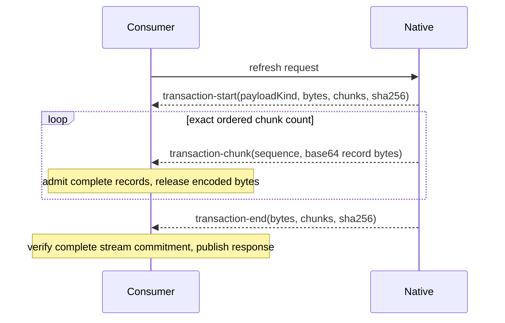

# Native analysis protocol

The protocol adapter owns a bounded JSONL trust boundary between a resident native analyzer and
portable JavaScript consumers. The native process may keep compiler objects private, but every
consumer-visible result is a validated `NativeAnalysisResponse`.

The native producer writes independently decodable JSON records using
`base64-json-records/1`. A header declares the generation and exact manifest/upsert/delete counts;
ordered records then carry one reference, shard or deletion each. Incremental analysis omits the
manifest and carries only affected upserts and deletes; the consumer reconstructs the complete
manifest against its pinned base. The adapter also accepts the original terminal responses and
`base64-json` transaction encoding for compatible producers.

Chunking is a wire concern only. It does not create partially visible generations, expose a native
wire type to analysis consumers, or change the atomic fact-transaction contract. A missing,
duplicate, reordered, oversized, malformed, or digest-invalid frame fails the session without
publishing a response.

The record producer sizes and hashes one record at a time, then writes bounded chunks without a
transaction-sized serialization buffer. The consumer checks shard identity and semantic payload
budgets as each complete record arrives. It retains admitted immutable facts, a partial record,
and the incremental stream hash; it never concatenates or parses a whole record transaction.
UTF-8 characters and individual shards can span frames. Missing, reordered, duplicate, unterminated
or invalid UTF-8 records fail admission. Each record is limited to 64 MiB including its newline,
and each shard to 384 MiB of expanded semantic payloads by default. Physical metadata remains
bounded by the encoded record limit. These are transient ingestion bounds, not a claim that the
complete retained fact store or compiler fits in one record's memory.

Explicit aggregate physical and semantic budgets still apply to the actual response upserts,
including a replayed pending candidate. Without such an explicit budget, record streaming does not
impose a total project-size ceiling. The adapter negotiates private `recordLimits` on refresh
requests. An older producer ignores that additive field and retains its original CLI defaults;
legacy terminal/base64-json responses remain bounded at 384 MiB semantic and 512 MiB physical
because they still assemble an entire response. Configured aggregate bounds apply to both paths.

Native publication is commit-late. The process retains one replayable candidate until the
application store commits the reconstructed transaction and acknowledges its exact generation and
sequence. A failed validation, cancellation, or store commit cannot advance the resident generation.

Diagnostic telemetry is opt-in and never enters semantic stdout. Unix hosts retain descriptor 3;
Windows hosts request `--telemetry-stderr`, because Go's Windows file handles are not CRT descriptor
numbers. Each stderr telemetry line begins with `@astrale/codegraph/telemetry ` and must also carry
the native telemetry format/version. The adapter bounds candidate lines by the diagnostic limit,
retains ordinary or malformed diagnostics, and resumes framing after oversized lines. Observer
failure cannot change semantic results. This transport is qualified with the exact release binary;
an older binary that rejects the option fails visibly rather than silently disabling telemetry.
