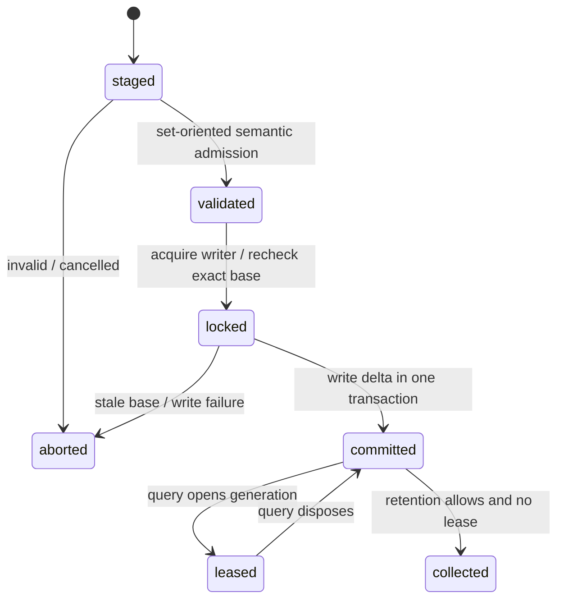

# SQLite analysis materializer

SQLite is a regenerable implementation of `AnalysisStore`, not a semantic owner. It adds durable
atomicity, concurrent reader isolation, writer coordination, migrations, corruption recovery, and
lease-aware garbage collection without changing facts or query meaning.

The production schema is normalized and content-addressed. Immutable generation rows name reusable
fact shards; facts, evidence, and derivation inputs remain independently indexed. Open-ended fact
payloads remain JSON, but a complete generation is never stored or rewritten as one snapshot JSON
value. The prerelease snapshot-JSON implementation is retained only as migration and correctness
oracle evidence.

The default payload layout keeps each semantic payload independently addressable. This makes
header-first selection and exact-ID hydration proportional to the requested facts. Whole-shard
Brotli materialization remains available explicitly for archival or predominantly full-scan
workloads, but it is not the interactive default because selecting one fact would otherwise require
decompressing and reconstructing all payloads owned by its shard.

Internal ownership is hierarchical: `schema/` owns migrations and integrity, `materialization/`
owns fact encoding, membership validation, and writes, `lifecycle/` owns leases and retention, and
`query/` owns generation-pinned indexed readers. Each leaf stays small and flat; `store.ts` only
coordinates these owners behind the generic contract.

Semantic admission runs once against indexed current membership before the writer lock and never
hydrates unaffected payloads. Once the lock is acquired, the store rechecks the exact current
generation identity and sequence; immutable shard content and the synchronously admitted caller
transaction need no second semantic scan. Changed content-addressed payloads are encoded before the
lock and only their rows plus the next immutable generation membership are written.

An advisory caller may explicitly fall back to memory after an attributable open/recovery failure.
A caller requiring durability fails instead. SQLite-specific connection and schema types do not
escape the constructor.
