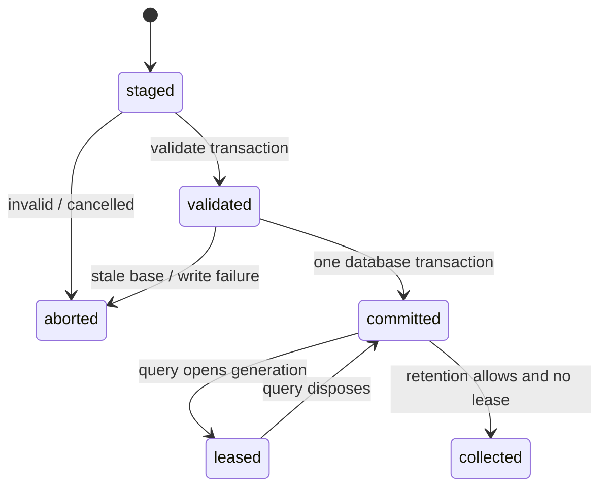

# SQLite analysis materializer

SQLite is a regenerable implementation of `AnalysisStore`, not a semantic owner. It adds durable
atomicity, concurrent reader isolation, writer coordination, migrations, corruption recovery, and
lease-aware garbage collection without changing facts or query meaning.

The production schema is normalized and content-addressed. Immutable generation rows name reusable
fact shards; facts, evidence, and derivation inputs remain independently indexed. Open-ended fact
payloads remain JSON, but a complete generation is never stored or rewritten as one snapshot JSON
value. The prerelease snapshot-JSON implementation is retained only as migration and correctness
oracle evidence.

Internal ownership is hierarchical: `schema/` owns migrations and integrity, `materialization/`
owns fact encoding, membership validation, and writes, `lifecycle/` owns leases and retention, and
`query/` owns generation-pinned indexed readers. Each leaf stays small and flat; `store.ts` only
coordinates these owners behind the generic contract.

An advisory caller may explicitly fall back to memory after an attributable open/recovery failure.
A caller requiring durability fails instead. SQLite-specific connection and schema types do not
escape the constructor.
