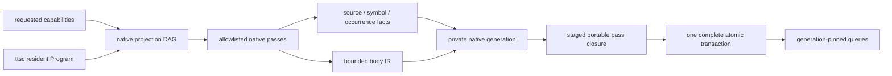

# TypeScript semantic adapter

The adapter is the sole compiler-aware analysis owner. Trusted native code reads the resident
TypeScript-Go Program and Checker, then emits portable facts. TypeScript derivation and downstream
policies never receive compiler pointers or synchronous Checker RPC.

Physical organization follows semantic ownership. The adapter is a hierarchy of independently
reusable capabilities (`surface`, `body`, `value`, native bridge), while each leaf capability keeps
its cohesive implementation files mostly flat. A nested directory must introduce a real owner or
publicly testable capability; horizontal `utils`, `helpers`, or layer-wide model buckets are not
owners. Facades re-export contracts and do not accumulate orchestration logic.

The projection DAG is operational, not a second semantic model. It derives exact native stages from
the requested capability set, executes only those stages and their compiler prerequisites, and emits
the same namespace facts as the corresponding projection of an all-capability cold build. A catalog
request for module facts therefore never walks bodies, CFG, definition-use, or general occurrences.
Adding demand-driven scope later must extend capability coverage explicitly; it cannot reinterpret
missing globally scoped facts as negative evidence.

The symbol graph and occurrence stream are complementary. A deduplicated relationship is useful
for topology, while each call, access, construction, render, assignment, return, and branch remains
independent evidence. Body IR is a purpose-built portable representation; it is not serialized
TypeScript AST and does not promise unrestricted SSA or whole-program evaluation.

Occurrence relations retain the semantic roles downstream passes actually need—callee, indexed
argument or property, name, initializer, condition, and branch arm—without exposing TypeScript-Go
node objects. A consumer can therefore recognize a generic builder/options shape from facts while
the native adapter remains unaware of that SDK's names or policy.

The public surface is source-semantic: explicit alias and algebraic boundaries are evidence worth
preserving, while targets, substitutions, overloads, and inferred types come from the resident
Checker. Public symbols use portable source coordinates plus qualified authored paths; compiler byte
positions remain provenance and never identity. External re-export ownership follows local barrels,
and package ownership walks past nameless nested module-format manifests to the nearest named owner.
One extraction shares named and absent ownership results by directory, so sibling source files do
not repeat filesystem walks. Those results never cross a refresh or retain stale package metadata.
Consumers that need expansion, reduction, or assignability request a derived capability above the
base fact; native extraction does not serialize competing authoritative views.

The native generation identifier is never reused as the published portable base. The pipeline keeps
that compiler lineage private, validates the complete native manifest, stages the requested portable
closure over it, and advances the caller-owned store once. A mandatory pass, validation, cancellation,
or commit failure therefore cannot expose a native-only intermediate generation.

Incremental extraction is ownership-driven. The resident compiler proves whether an edit preserved
its import graph and declaration shape. Callable projection also records the foreign declarations
actually read while following runtime const aliases and locating callback bodies; declaration emit
alone cannot describe those values. The acknowledged native generation retains these portable observations
and their reverse source dependencies, without retaining Checker objects. A private edit revalidates
only expressions which read its source, using the current Checker and the same projector. Recorded
expressions are located in one syntax walk per affected owner, without a separate scan per call. An unchanged
target preserves the consumer's shards while retaining any newly read dependencies; a changed target
or absent expression selects that consumer for projection. Replacing an owning source removes its old
observations. Public-shape changes expand through TypeScript's reverse dependencies. The logical
public module observation remains complete. Its physical schema stores each canonical declaration
once in a content-addressed declaration shard under the existing module capability namespace and
stores only declaration identity, fact identity, and owner-local export paths in module shards. The
typed reader distinguishes module and declaration kinds and hydrates that representation back to
the unchanged complete module contract. Logical module identity streams the canonically ordered
declaration preimage from that shared support; it never reconstructs a repeated in-memory closure
behind the normalized physical schema. The private projector recomposes only affected semantic
owners from current owner inputs plus retained canonical outbound dependencies. Dependency,
global-diagnostic, public-shape, topology, configuration, plugin, or uncertain changes conservatively
expand the module projection. Native transport sends only the resulting delta, and the process
advances its private base only after application-store acknowledgement.

The resident process owns exactly one acknowledged generation and, during publication, one pending
candidate with its replay transaction. Refresh accepts only the acknowledged base, so retaining
historical native indexes would serve no reader. Acknowledgement transfers the candidate into the
base slot and releases the previous manifest, source ownership, and dependency indexes; closing the
session releases both slots. Candidate construction still preserves the base's immutable evidence
until publication succeeds. A rejected store commit can replay the exact candidate, an interrupted
process recovers from the client store, and a universe rollover remains a complete snapshot whose
sequence is adopted only after acknowledgement. Historical snapshots and reader leases belong to
the client store and survive independently of the native process.

This removes the former sixteen-generation multiplier on retained index containers. One generation
still requires project-sized metadata, and a pending refresh temporarily owns both generations.
Immutable unchanged entries remain shared; complete manifest hashing and index construction retain
their existing project-sized work. This change does not reduce the cold compiler's own heap.

Record-stream admission bounds each encoded JSON record (including its newline) and the sum of
expanded semantic payload bytes within each shard. Explicit aggregate budgets apply to the actual
transaction upserts, including pending replays, independently of discarded projection work. The
private refresh request negotiates those record budgets so older binaries can ignore the extension
and retain their bounded legacy aggregate protocol. Package and compiler telemetry still report
all projection work; disabling an implicit aggregate project-size cap does not hide its cost.

Each admitted packed body owns its lazy adjacency projection. Relations and definition uses are
indexed by private numeric offset and row-ordinal tables, rather than per-occurrence maps and link
objects. Construction is linear in local occurrences, links, and the body's text dictionary;
collapsing child roles temporarily uses two 32-bit arrays over that dictionary. Empty link columns
allocate no occurrence-sized table. Stable buckets retain parent and definition order, including repeated
definitions and self-edges. Child roles retain their first insertion position and last child,
collapsing replacements once so reads visit only the resulting children. Definite reaching uses
occupy a local bitset. The raw packed rows remain immutable and authoritative, and returned maps
and arrays are independent reader values. Unchanged physical records reuse their projection;
changed records own new tables while pinned snapshots keep the old ones. Codecs 1–5, logical
identity, semantic admission, and unowned or foreign-codec fallback are unchanged.

The symbolic index owns one immutable contribution per admitted packed occurrence or call. Its
fact identity, body fragment, and row ordinal also serve as the column's singleton entry; the
fragment keeps no second array of row references. A private self-valued data field lets ordinary
column reads use that same object without a getter or a second lookup. Projected occurrences,
calls, portable proofs, and transport payloads never expose these entries. Overlapping facts retain
their individual contributions and project them in fact-identity order, so promotion and demotion preserve the exact
surviving entry and pinned index roots. Function identity never replaces contributing fact identity.
Generic overlapping columns also retain their contribution wrappers, and their cost belongs in any
net memory comparison. Logical or custom bodies own their original captured row references and
adjacency containers separately; packed bodies allocate none of those fallback containers. Deleting
a packed body visits its row ordinals without constructing replacements. This removes redundant
row storage, while the shared hash trie, lookup keys, physical records, and other columns remain.

Native identity encoding retains immutable canonical bytes for acknowledged source and shard
references. A refresh encodes replacement entries only and streams the complete ordered preimage
into the existing v1 identity hash. This preserves exact portable generation validation and older
retained generations without rebuilding a second JSON object graph. Hashing and ordering the full
manifest remain linear in total project size; telemetry distinguishes entries encoded from bytes
hashed so that reduced allocations cannot be mistaken for a fully incremental identity contract.
During one canonical encoding, nested objects borrow a shared field workspace and return it on
completion. Its storage follows the active nesting path, while a typed stable sort preserves
duplicate-key last-value semantics. The workspace ends with that encoding and retains no project
or generation state.

Identity construction serializes each newly projected logical payload once. A private prepared fact
owns the canonical payload bytes until its shard is finalized; exact v1 fact and shard envelopes stream
those same bytes into their full SHA-256 preimages. Admission retains the original semantic JSON
byte count, including HTML escapes, independently of its canonical spelling. Final module logical
IDs enter the shard envelope after normalization; generation and physical codec metadata stay
excluded. Finalization publishes ordinary facts without the temporary bytes, and normalized
declaration shards finalize individually so their canonical payloads never accumulate across the
project. A failed encoding or budget admission cannot advance the acknowledged generation.

The caller describes requested project inputs but never supplies a universe identifier. After the
resident compiler loads the complete configuration chain, referenced project configurations, compiler and
plugin semantics, exact toolchain and protocol, and platform, the native adapter derives the
portable universe. Requested capabilities and module-observation boundaries select a generation in
that universe; they never rename the compiler project or its stable semantic identities. A changed
compiler universe starts a complete base-less lineage, while restoring identical compiler inputs may
select the already retained generation for that universe. Universe identity v2 retains the entry
project, every referenced project configuration, exact configuration content, toolchain, and platform.
Files discovered by configuration globs belong to the generation's source manifest. Adding or
removing a source forces a complete compiler projection, including negative module resolutions,
while preserving the universe and existing portable symbol identities. Explicit configuration or
project-reference edits still establish a separate universe; old pinned generations remain exact.
