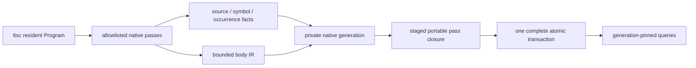

# TypeScript semantic adapter

The adapter is the sole compiler-aware analysis owner. Trusted native code reads the resident
TypeScript-Go Program and Checker, then emits portable facts. TypeScript derivation and downstream
policies never receive compiler pointers or synchronous Checker RPC.

Physical organization follows semantic ownership. The adapter is a hierarchy of independently
reusable capabilities (`surface`, `body`, `value`, native bridge), while each leaf capability keeps
its cohesive implementation files mostly flat. A nested directory must introduce a real owner or
publicly testable capability; horizontal `utils`, `helpers`, or layer-wide model buckets are not
owners. Facades re-export contracts and do not accumulate orchestration logic.

The symbol graph and occurrence stream are complementary. A deduplicated relationship is useful
for topology, while each call, access, construction, render, assignment, return, and branch remains
independent evidence. Body IR is a purpose-built portable representation; it is not serialized
TypeScript AST and does not promise unrestricted SSA or whole-program evaluation.

Occurrence relations retain the semantic roles downstream passes actually need—callee, indexed
argument or property, name, initializer, condition, and branch arm—without exposing TypeScript-Go
node objects. A consumer can therefore recognize a generic builder/options shape from facts while
the native adapter remains unaware of that SDK's names or policy.

The public surface is source-semantic: explicit alias and algebraic boundaries are evidence worth
preserving, while targets, substitutions, overloads, and inferred types come from the resident
Checker. Public symbols use portable source coordinates plus qualified authored paths; compiler byte
positions remain provenance and never identity. External re-export ownership follows local barrels,
and package ownership walks past nameless nested module-format manifests to the nearest named owner.
Consumers that need expansion, reduction, or assignability request a derived capability above the
base fact; native extraction does not serialize competing authoritative views.

The native generation identifier is never reused as the published portable base. The pipeline keeps
that compiler lineage private, validates the complete native manifest, stages the requested portable
closure over it, and advances the caller-owned store once. A mandatory pass, validation, cancellation,
or commit failure therefore cannot expose a native-only intermediate generation.

The caller describes requested project inputs but never supplies a universe identifier. After the
resident compiler loads the complete configuration chain, project-reference roots, module
boundaries, capabilities, exact toolchain and protocol, and platform, the native adapter derives the
portable universe. A changed universe starts a complete base-less lineage; restoring identical inputs
may select the already retained generation for that universe.
