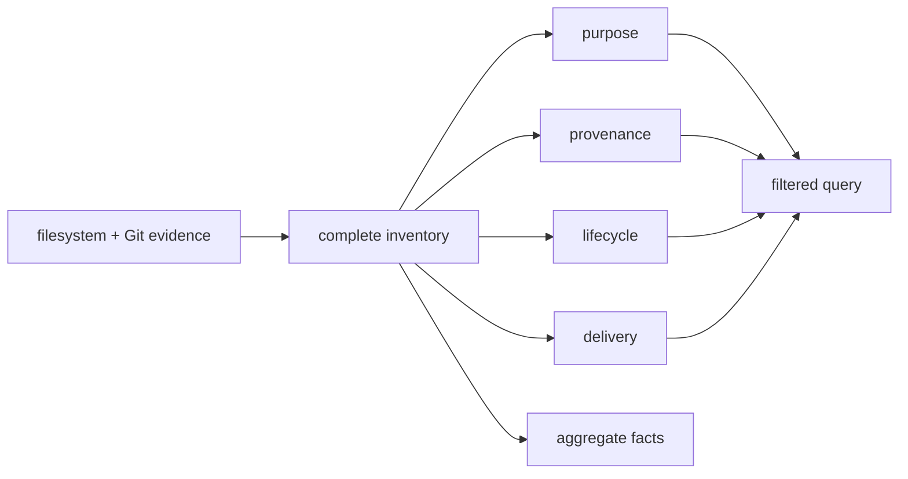

# Repository evidence

Repository inventory describes files whether or not TypeScript includes them. Purpose, provenance,
lifecycle, and delivery are independent classifications backed by evidence. Filters choose a view;
they never erase retained evidence or change a project universe.

Tests, fixtures, specifications, generated output, evidence, assets, and unknown files remain first-
class inventory records. TypeScript project membership is joined later through portable source
identity; it is not inferred from a repository-purpose filter.
