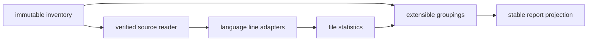

# Repository statistics

Statistics are deterministic projections over an immutable repository inventory and its verified
source reader. The module does not discover files, construct compiler projects, retain source text,
or assign TypeScript identities. Language adapters classify lines; generic groupings produce package,
area, purpose, provenance, lifecycle, and delivery views. Consumers can add module or domain groupings
without changing the retained file facts. The reusable path-ownership adapter resolves nested owners
by deepest matching root and keeps unmatched files in an explicit `unassigned` group.

Unknown text is counted conservatively: physical and blank lines remain exact while non-blank lines
stay `unclassified`. A trailing comment on a code line is counted as code. Missing or stale pinned
source produces attributable unavailable evidence rather than a zero count. Binary files remain in
file and byte totals, but line metrics are explicitly not applicable and therefore zero by definition.

