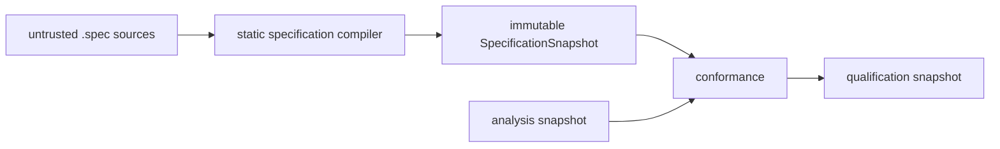

# Specification compiler

The compiler owns normative `.spec` meaning. It inventories the closed authoring grammar, compiles
declarations and static descriptors, validates cross-resource semantics, and freezes one
content-addressed snapshot. It does not discover implementation bindings, resolve test outcomes,
observe physical layout conformance, or construct catalog/viewer state.

Architecture and `.history` remain inspectable context but are not inputs to the normative digest.
