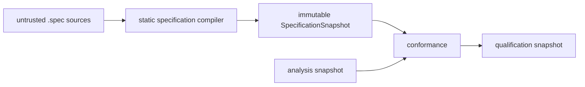

# Specification compiler

The compiler owns normative `.spec` meaning. It inventories the closed authoring grammar, compiles
declarations and static descriptors, validates cross-resource semantics, and freezes one
content-addressed snapshot. It does not discover implementation bindings, resolve test outcomes,
observe physical layout conformance, or construct catalog/viewer state.

Architecture and `.history` remain inspectable context but are not inputs to the normative digest.
Previous snapshots may seed declaration results only when the exact inventory delta contains no
declaration or configuration input; the declaration source revision is still revalidated and seeded
compilation must equal an unseeded source compilation.

Cold compilation groups owners by compatible compiler semantics, not by owner count. Declaration
Programs isolate ambient sources and conflicting external-package projections. Other specification
TypeScript shares a Program up to a bounded number of admitted root sources, then isolates any
closure with global or ambient effects. Every projection remains differentially equal to the
owner-isolated compiler.

Declaration source-navigation tokens are a presentation projection, not authored normative meaning.
Headless checks may omit their construction explicitly; catalog and viewer requests retain them.
Diagnostics-only checks may also omit complete normalized declaration models after exact compiler
diagnostics and dependency revisions have been established.
